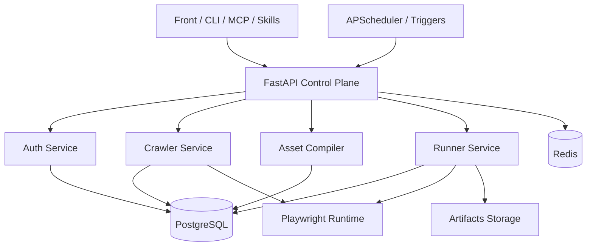

# AI Playwright 执行平台架构设计

**日期：** 2026-04-01  
**作者：** Codex  
**状态：** Draft

---

## 1. 总体架构

平台建议采用五层结构：

1. 接入层
2. 控制层
3. 领域服务层
4. 任务与执行层
5. 基础设施层



---

## 2. 子域职责

### 2.1 `control_plane`

职责：

- 接收外部结构化检查请求
- 归一化系统、页面、检查目标
- 决定走预编译轨还是实时装配轨
- 编排认证、执行、补采集、补编译
- 输出统一任务与执行结果

它是唯一允许跨域编排的中心域。

### 2.2 `auth_service`

职责：

- 管理系统登录配置和加密凭证
- 自动登录并刷新 `storage_state`
- 校验认证有效性
- 向运行时浏览器上下文注入认证

### 2.3 `crawler_service`

职责：

- 基于认证态采集菜单、页面、元素
- 优先使用框架注入提取
- 降级到 DOM 仿真遍历
- 生成事实快照和抓取质量指标

### 2.4 `asset_compiler`

职责：

- 将事实快照编译为页面级检查资产
- 维护标准检查项
- 维护动作模块和模块计划
- 计算结构指纹和漂移状态
- 执行重验证与重编译策略

### 2.5 `runner_service`

职责：

- 接收归一化的执行计划
- 拉取认证上下文
- 执行 Playwright 检查
- 产出结构化结果、截图、日志、trace

---

## 3. 依赖方向

建议单向依赖如下：

- `control_plane -> auth_service`
- `control_plane -> crawler_service`
- `control_plane -> asset_compiler`
- `control_plane -> runner_service`
- `runner_service -> auth_service`
- `asset_compiler -> crawler_service` 只读事实快照

其他域不允许自由交叉编排。

---

## 4. 关键运行链路

### 4.1 用户检查链

```text
skills/mcp/front/cli
  -> API
  -> control_plane
  -> auth_service
  -> runner_service
  -> execution result
```

### 4.2 采集更新链

```text
scheduler/cli
  -> crawler_service
  -> crawl snapshots
  -> asset_compiler
  -> page assets / page checks
```

### 4.3 调度执行链

```text
scheduler / platform trigger
  -> control_plane
  -> asset lookup
  -> auth_service
  -> runner_service
  -> job result
```

---

## 5. 运行时链路

### 5.1 请求入口

所有正式执行必须先转化为结构化请求，例如：

- `system_hint`
- `page_hint`
- `check_goal`
- `strictness`
- `time_budget_ms`
- `request_source`

自然语言解析应在 Skills 或上层接入完成，不应直接进入浏览器执行域。

### 5.2 意图归一化

`control_plane` 收到请求后按如下顺序命中：

1. `systems`
2. `intent_aliases`
3. `page_assets`
4. `page_checks`

只有资产无法命中时，才回退到 `pages / page_elements`。

### 5.3 双轨执行

#### 预编译轨

命中条件：

- `page_check.status = ready`
- 资产未过期
- 运行策略允许直接执行

执行内容来自 `module_plan`，而不是从零生成完整脚本文本。

#### 实时装配轨

仅在以下情况触发：

- 没有对应 `page_asset`
- 没有对应 `page_check`
- 资产状态允许降级
- 用户请求为长尾场景

实时装配仅允许使用：

- 一个页面
- 一个导航计划
- 一个定位器包
- 一组动作模块

### 5.4 认证注入

正式执行时：

1. `auth_service` 查找最新有效 `auth_state`
2. 如失效则按策略决定是否刷新
3. 由服务端将认证注入 Playwright context
4. `runner_service` 在受控上下文中执行

已发布脚本不应自行决定认证获取逻辑。

### 5.5 结果输出

每次执行统一输出：

- 解析出的系统 / 页面 / 检查项
- 轨道：`precompiled` / `realtime`
- 认证状态：`reused` / `refreshed` / `blocked`
- 资产版本
- 执行耗时
- 失败分类
- 是否触发补采集 / 补编译

---

## 6. 脚本生成与调度模型

### 6.1 基本原则

平台内部的主调度对象不是“脚本文本文件”，而是：

- `page_check`
- `asset_version`
- `module_plan`
- `runtime_policy`

脚本仅作为以下两种场景的产物：

1. 运行时临时渲染
2. 发布给外部调度平台或 CI 的固定工件

### 6.2 双模式

#### 模式 A：平台内资产调度

平台内部定时任务调度对象是：

- `page_check_id`
- `asset_version`
- `runtime_policy`

执行前由平台决定：

- 直接跑模块计划
- 或临时渲染脚本再跑

#### 模式 B：脚本发布调度

平台可将某个检查资产发布为 Playwright 脚本工件，绑定：

- `page_check_id`
- `asset_version`
- `render_version`
- `auth_policy`

外部调度平台消费的是“有来源、可追溯”的脚本。

### 6.3 调度触发方式

建议支持：

- `cron schedule`
- `event trigger`
- `manual trigger`

调度平台优先调度：

- `page_check`
- `published_job`

而不是只认某个静态脚本路径。

---

## 7. 漂移检测与资产更新机制

### 7.1 核心原则

不要把同步目标定义成“页面变了，脚本怎么重写”。

应该定义成：

- 页面结构是否漂移
- 哪些资产失效
- 是否需要重验证或重编译

### 7.2 结构指纹

每次 crawl 完成后建议生成：

- 导航链指纹
- 路由指纹
- 关键定位器集合指纹
- 页面语义摘要指纹

### 7.3 资产状态

建议至少三种：

- `safe`
- `suspect`
- `stale`

### 7.4 更新流水线

1. 采集生成新快照
2. 计算与上次快照的结构差异
3. 标记受影响的 `page_assets / page_checks`
4. 自动重验证
5. 可修复则重编译
6. 不可修复则标记 `stale`

### 7.5 分级策略

- 核心系统 / 核心页面：`stale` 时阻断
- 长尾页面：允许受控降级到实时装配轨

---

## 8. 安全与审计

### 8.1 认证边界

- 认证状态必须由平台服务端控制
- 不默认向上层 AI 暴露完整 `storage_state`
- 凭证和敏感信息必须加密存储

### 8.2 执行边界

- 所有正式执行都走统一控制面
- CLI / MCP / Skills 不允许绕过正式执行链
- 已发布脚本必须绑定资产版本和认证策略

### 8.3 审计要求

建议记录：

- 谁触发了任务
- 使用了哪个资产版本
- 使用了哪种认证策略
- 生成或发布了哪个脚本版本
- 是否发生自动重认证 / 重采集 / 重编译
