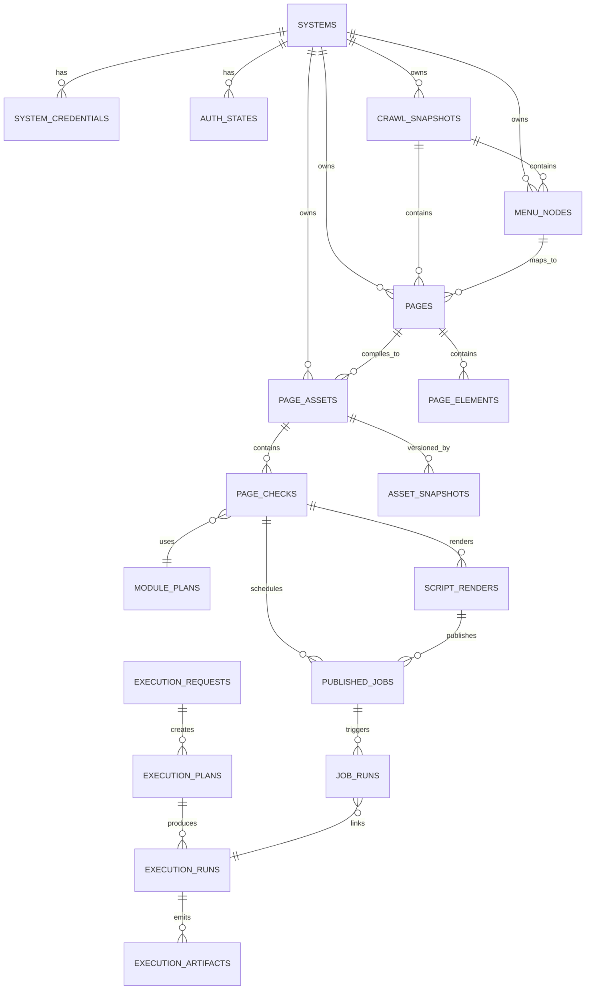

# AI Playwright 执行平台数据模型与 ER 设计

**日期：** 2026-04-01  
**作者：** Codex  
**状态：** Draft

---

## 1. 建模目标

新平台至少包含四类模型：

1. 事实层
2. 资产层
3. 执行层
4. 调度与脚本层

建模原则：

1. 运行时默认从 `intent_aliases -> page_assets -> page_checks` 开始命中
2. 调度对象优先是 `page_check` 或 `published_job`
3. `script_renders` 记录脚本产物，但不反向成为平台唯一真相
4. 事实层可追加采集字段，但不能侵入资产层职责
5. 执行层只记录运行结果，不混入资产定义

---

## 2. 事实层模型

### `systems`

- `id`
- `code`
- `name`
- `base_url`
- `framework_type`
- `health_status`
- `default_runtime_policy_id`

### `system_credentials`

- `id`
- `system_id`
- `login_url`
- `login_username_encrypted`
- `login_password_encrypted`
- `login_auth_type`
- `login_selectors`
- `secret_ref`

### `auth_states`

- `id`
- `system_id`
- `storage_state`
- `cookies`
- `local_storage`
- `session_storage`
- `token_fingerprint`
- `auth_mode`
- `is_valid`
- `validated_at`
- `expires_at`

### `crawl_snapshots`

- `id`
- `system_id`
- `crawl_type`
- `framework_detected`
- `quality_score`
- `degraded`
- `structure_hash`
- `started_at`
- `finished_at`

### `menu_nodes`

- `id`
- `system_id`
- `snapshot_id`
- `parent_id`
- `title`
- `breadcrumb`
- `route_path`
- `target_url`
- `playwright_locator`

### `pages`

- `id`
- `system_id`
- `snapshot_id`
- `menu_id`
- `route_path`
- `page_title`
- `page_summary`
- `keywords`
- `crawled_at`

### `page_elements`

- `id`
- `page_id`
- `element_type`
- `text_content`
- `playwright_locator`
- `locator_tier`
- `stability_score`
- `usage_description`

---

## 3. 资产层模型

### `page_assets`

- `id`
- `system_id`
- `page_id`
- `asset_key`
- `asset_version`
- `status`
- `priority`
- `compiled_from_snapshot_id`
- `last_verified_at`

### `page_checks`

- `id`
- `page_asset_id`
- `check_code`
- `goal`
- `input_schema`
- `assertion_schema`
- `module_plan_id`
- `success_rate`
- `last_verified_at`

标准检查项示例：

- `page_open`
- `table_render`
- `open_create_modal`
- `search_submit`

### `action_modules`

- `id`
- `module_code`
- `module_version`
- `framework_scope`
- `input_contract`
- `runtime_contract`

### `module_plans`

- `id`
- `plan_code`
- `plan_version`
- `steps_json`
- `retry_policy`
- `assertions_json`

### `asset_snapshots`

- `id`
- `page_asset_id`
- `crawl_snapshot_id`
- `navigation_hash`
- `key_locator_hash`
- `semantic_summary_hash`
- `diff_score_vs_previous`

### `intent_aliases`

- `id`
- `system_alias`
- `page_alias`
- `check_alias`
- `route_hint`
- `asset_key`
- `confidence`
- `source`

---

## 4. 执行层模型

### `execution_requests`

- `id`
- `request_source`
- `system_hint`
- `page_hint`
- `check_goal`
- `strictness`
- `time_budget_ms`

### `execution_plans`

- `id`
- `execution_request_id`
- `resolved_system_id`
- `resolved_page_asset_id`
- `resolved_page_check_id`
- `execution_track`
- `auth_policy`
- `module_plan_id`

### `execution_runs`

- `id`
- `execution_plan_id`
- `status`
- `duration_ms`
- `auth_status`
- `failure_category`
- `asset_version`
- `snapshot_version`

### `execution_artifacts`

- `id`
- `execution_run_id`
- `artifact_type`
- `file_path`
- `metadata`

---

## 5. 调度与脚本层模型

### `script_renders`

- `id`
- `page_check_id`
- `asset_version`
- `render_version`
- `render_mode`
- `script_content`
- `script_path`
- `render_status`

### `published_jobs`

- `id`
- `script_render_id`
- `page_check_id`
- `schedule_type`
- `schedule_expr`
- `trigger_source`
- `enabled`

### `job_runs`

- `id`
- `published_job_id`
- `execution_run_id`
- `triggered_by`
- `status`
- `started_at`
- `finished_at`

### `runtime_policies`

- `id`
- `scope_type`
- `scope_id`
- `is_core`
- `stale_behavior`
- `auth_refresh_behavior`
- `realtime_fallback_allowed`
- `max_retry`
- `timeout_budget_ms`

---

## 6. ER 关系图

---

## 7. 关键关系说明

### 7.1 事实层到资产层

- `pages -> page_assets` 表示页面被编译为可执行资产
- `crawl_snapshots -> asset_snapshots` 表示某版资产来源于哪次采集快照

### 7.2 资产层到执行层

- `page_checks -> execution_plans` 表示一次执行计划命中了哪个检查资产
- `module_plans` 是执行计划的核心底座，而不是自由脚本文本

### 7.3 资产层到脚本层

- `page_checks -> script_renders` 表示某个检查可被渲染为脚本
- `script_renders -> published_jobs` 表示某个脚本工件被正式发布为调度任务

---

## 8. 数据库实现建议

建议：

- 主实体使用明确字段建模
- `module_plans.steps_json`、`input_schema`、`assertion_schema` 使用 `JSONB`
- `script_content` 可存储于对象存储，表中只保留路径与版本
- 高频查询字段建立索引：
  - `systems.code`
  - `pages.route_path`
  - `page_assets.asset_key`
  - `page_checks.check_code`
  - `published_jobs.enabled`

不建议：

- 将全部模型压成少量大 JSON 表
- 将脚本文本作为唯一主键对象
- 让执行记录反向覆盖资产定义
