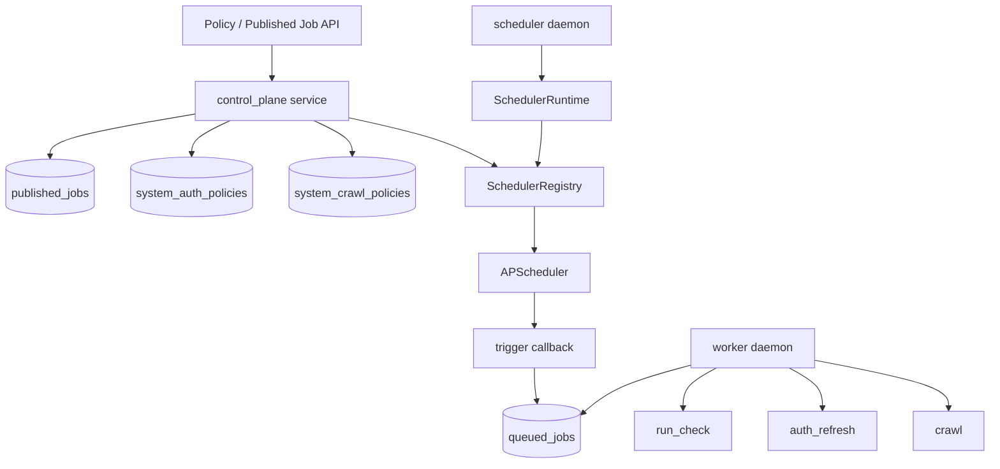

# APScheduler 统一调度改造设计

**日期：** 2026-04-02  
**作者：** Codex  
**状态：** 已实施（Implemented）

---

## 1. 文档定位

本文档定义后端调度能力从“自研 cron 扫描”改造为“数据库为真相、APScheduler 为统一触发器”的方案，并同步截至 2026-04-02 的实现对齐状态，覆盖以下两类调度对象：

- `published_jobs`
- `system_auth_policies` / `system_crawl_policies`

本文档保留设计决策，并补充已落地实现状态。设计继续遵守仓库中的核心约束：

- 检查资产是主模型
- Playwright 脚本是派生产物
- 正式执行统一走 `control_plane`
- 认证注入必须由服务端统一处理
- 平台默认调度对象是 `page_check`、`asset_version`、`runtime_policy`，不是孤立脚本文本

---

## 2. 背景与实施对齐

本文档创建时用于解决“文档定义 APScheduler、代码仍使用自研扫描”的漂移问题。  
截至 2026-04-02，改造已按计划落地，当前对齐状态如下：

1. 后端已引入 `apscheduler`，并建立 `SchedulerRegistry + SchedulerRuntime + scheduler daemon` 主链。
2. `published_jobs` 已移除批量扫库触发入口，不再暴露 `SchedulerService.trigger_due_jobs()` 风格接口。
3. 调度触发统一通过 APScheduler callback 调用 `PublishedJobService.trigger_scheduled_job(published_job_id, scheduled_at)`。
4. `runtime_policies`（auth/crawl）schema、API 与调度注册链路已接入统一触发面，并回到 `queued_jobs -> worker` 执行主链。
5. 文档、测试与实现已围绕“数据库真相 + APScheduler 触发器”重新对齐。

---

## 3. 目标与非目标

### 3.1 目标

本次改造目标如下：

1. 统一使用 `APScheduler` 承载平台内部定时触发能力。
2. 保持数据库仍为调度真相源，不把 APScheduler job store 作为业务真相。
3. 把 `published_jobs`、`system_auth_policies`、`system_crawl_policies` 收口到同一套调度运行面。
4. 保持“到点触发”和“正式执行”分离：
   - APScheduler 只负责编排触发；
   - 正式执行仍然走 `control_plane -> queued_jobs -> worker` 主链。
5. 保持单实例调度器部署模型，避免第一版引入分布式锁与多实例 leader 选举复杂度。
6. 在进程重启后，能够基于数据库全量恢复调度注册。

### 3.2 非目标

第一版明确不做以下内容：

- 不让 APScheduler 直接执行浏览器动作或检查模块
- 不把 APScheduler job store 作为主持久层
- 不在 `auth_service`、`crawler_service`、`runner_service` 内各自维护独立调度器
- 不支持多实例 scheduler 并发抢占
- 不直接调度脚本文本文件路径作为平台主链
- 不在本轮引入复杂的调度事件总线或分布式一致性机制

---

## 4. 方案选择

### 4.1 备选方案

#### 方案 A：数据库为真相，APScheduler 作为统一触发器

- 业务真相保留在：
  - `published_jobs`
  - `system_auth_policies`
  - `system_crawl_policies`
- APScheduler 只负责把数据库中的启用策略注册为内存 job，并在到点后调用统一 enqueue 入口。

优点：

- 最符合现有数据模型与审计模型
- 最符合“正式执行统一走 `control_plane`”的边界
- 不会引入双真相源
- 单实例下实现复杂度可控

缺点：

- 需要增加数据库策略与 APScheduler job 之间的同步层
- 现有自研 cron 扫描逻辑需要拆分与退场

#### 方案 B：让 APScheduler job store 成为主要调度真相

优点：

- 调度器概念上更集中

缺点：

- 会与现有业务表形成双写
- 审计链和恢复逻辑复杂
- 与现有架构约束冲突较大

#### 方案 C：分阶段并存，两套调度体系暂时共存

- `published_jobs` 保留当前扫描实现
- `runtime_policies` 新增时直接接 APScheduler

优点：

- 初期接入成本较低

缺点：

- 两套调度实现并存，长期更难维护
- 运维与排障路径分裂

### 4.2 推荐结论

采用 **方案 A**。

理由如下：

1. 与现有领域模型最一致，不需要推翻 `published_jobs` 与后续 `runtime_policies` 的数据定义。
2. 与仓库中的架构约束一致，调度只负责触发，不直接越域执行业务。
3. 单实例下足以满足当前阶段目标，后续如需多实例可以在 `SchedulerRuntime` 外围补 leader 选举，而不必重写领域接口。

---

## 5. 总体架构

### 5.1 核心原则

统一后的调度链遵守以下原则：

1. 数据库是唯一调度真相源。
2. APScheduler 只负责“什么时候触发”，不负责决定业务真相。
3. `control_plane` 仍然是唯一跨域编排入口。
4. scheduler callback 只做 enqueue，不直接执行浏览器逻辑。
5. `worker` 仍然是唯一正式执行载体。

### 5.2 架构图

### 5.3 边界归属

- `control_plane`
  - 管理发布任务与 runtime policy
  - 提供统一 enqueue 入口
  - 拥有 scheduler runtime
- `runner_service`
  - 只负责执行被批准的 `page_check/module_plan`
  - 不再承担“扫描所有到点 cron 任务”的职责
- `auth_service`
  - 只处理认证刷新
- `crawler_service`
  - 只处理事实采集

---

## 6. 组件设计

### 6.1 `PublishedJobService`

该组件承接现有 `SchedulerService` 中与发布任务业务直接相关的职责：

- 创建 `published_job`
- 手动触发 `published_job`
- 查询 `published_job` 运行记录
- 触发单个 `published_job` 对应的 `job_run + queued_job`

该组件不再承担以下职责：

- 扫描全部发布任务
- 判断哪些 cron 当前到点
- 轮询数据库做统一触发

当前保留 `backend/src/app/domains/runner_service/scheduler.py` 文件名，但服务边界已收敛为发布任务创建/触发/查询与单条调度回调触发，不再包含全量扫描职责。

### 6.2 `RuntimePolicyService`

该组件放在 `control_plane` 域下，负责：

- 读取与更新 `system_auth_policies`
- 读取与更新 `system_crawl_policies`
- 根据策略状态决定是否需要注册或移除 APScheduler job

该组件不直接执行业务，仅负责策略真相维护。

### 6.3 `SchedulerRegistry`

该组件是数据库真相与 APScheduler 之间的映射层，负责：

- 将数据库对象转换为 APScheduler job
- 维护统一 job id 规范
- 对外提供：
  - `load_all_from_db()`
  - `upsert_published_job(...)`
  - `upsert_auth_policy(...)`
  - `upsert_crawl_policy(...)`
  - `remove_job(...)`

当前 job id 规范如下：

- `published_job:<published_job_id>`
- `auth_policy:<system_id>`
- `crawl_policy:<system_id>`

### 6.4 `SchedulerRuntime`

该组件是 APScheduler 的进程内宿主，负责：

- 初始化 APScheduler
- 启动时从数据库恢复全部有效调度对象
- 对接 API 写库后的增量注册/更新/移除
- 在 job fire 时调用统一 callback

### 6.5 `scheduler daemon`

`scheduler daemon` 是单实例常驻进程，负责启动 `SchedulerRuntime`。

第一版只支持单实例部署，因此不要求：

- leader 选举
- 分布式锁
- 多实例 job claim

---

## 7. 数据流设计

### 7.1 创建或更新 `published_job`

流程如下：

1. API 调用 `control_plane` 创建或更新 `published_job`
2. 数据库成功持久化 `published_jobs`
3. `SchedulerRegistry.upsert_published_job(...)` 把记录转换为 APScheduler job
4. APScheduler 使用 `CronTrigger` 注册 `published_job:<id>`

到点触发时：

1. APScheduler fire
2. callback 重新加载 `published_job`
3. 检查状态仍为 `active`
4. 调用单条触发逻辑，创建 `job_run`
5. 入队 `run_check`

### 7.2 创建或更新 `system_auth_policy`

流程如下：

1. API 调用 `control_plane` 更新认证策略
2. 数据库成功持久化 `system_auth_policies`
3. `SchedulerRegistry.upsert_auth_policy(...)` 注册 `auth_policy:<system_id>`

到点触发时：

1. APScheduler fire
2. callback 重新加载 `system_auth_policy`
3. 检查 `enabled + active`
4. 入队 `auth_refresh`
5. payload 附带 `policy_id`、`trigger_source="scheduler"`、`scheduled_at`

### 7.3 创建或更新 `system_crawl_policy`

流程如下：

1. API 调用 `control_plane` 更新采集策略
2. 数据库成功持久化 `system_crawl_policies`
3. `SchedulerRegistry.upsert_crawl_policy(...)` 注册 `crawl_policy:<system_id>`

到点触发时：

1. APScheduler fire
2. callback 重新加载 `system_crawl_policy`
3. 检查 `enabled + active`
4. 入队 `crawl`
5. payload 附带 `policy_id`、`trigger_source="scheduler"`、`scheduled_at`

### 7.4 删除、暂停与禁用

统一规则如下：

- 数据库状态优先
- APScheduler 只做镜像

因此在对象被暂停或禁用时：

1. 先更新数据库
2. 再调用 `SchedulerRegistry.remove_job(...)`

如果 remove 失败，不回滚数据库真相；允许通过后续 `load_all_from_db()` 或显式 reload 修复运行时镜像。

### 7.5 启动恢复

`scheduler daemon` 启动后执行：

1. 初始化 APScheduler
2. 扫描数据库中的有效对象：
   - `published_jobs.state = active`
   - `system_auth_policies.enabled = true and state = active`
   - `system_crawl_policies.enabled = true and state = active`
3. 统一注册至 APScheduler

该恢复机制保证：

- 进程重启后不丢调度定义
- 不依赖 APScheduler job store 持久化

---

## 8. 幂等与错误处理

### 8.1 幂等策略

虽然第一版是单实例 scheduler，但业务层仍必须保留去重语义：

- `published_job`
  - 同一分钟不重复创建 `job_run`
- `system_auth_policy`
  - 同一分钟同一 `policy_id` 不重复入队 `auth_refresh`
- `system_crawl_policy`
  - 同一分钟同一 `policy_id` 不重复入队 `crawl`

即：

- APScheduler 负责“尝试触发”
- 数据库负责“本次触发是否有效”

### 8.2 错误处理分层

#### 调度注册错误

例如：

- cron 表达式非法
- APScheduler 注册失败
- job id 冲突

处理原则：

- API 写库前先校验 cron
- 写库成功后注册失败时，应显式返回或记录错误
- 第一版允许通过重载修复，不引入复杂补偿事务

#### 触发回调错误

例如：

- 到点后对象被删除
- 状态已禁用
- callback enqueue 失败

处理原则：

- 不在 callback 内直接执行业务
- 记录失败日志或轻量审计信息
- 后续调度周期仍可继续尝试

#### 执行链错误

例如：

- `run_check` 执行失败
- `auth_refresh` 执行失败
- `crawl` 执行失败

这类错误继续由现有 worker 与 job handler 负责，不上提到 APScheduler 层。

---

## 9. 已落地文件与边界收口

### 9.1 已新增核心文件

- `backend/src/app/domains/control_plane/runtime_policies.py`
- `backend/src/app/domains/control_plane/scheduler_registry.py`
- `backend/src/app/runtime/scheduler_runtime.py`
- `backend/src/app/runtime/scheduler_daemon.py`
- `tests/backend/test_runtime_policies_api.py`
- `tests/backend/test_scheduler_runtime.py`
- `tests/backend/test_scheduler_daemon.py`

### 9.2 已修改关键文件

- `backend/pyproject.toml`：已接入 `apscheduler`
- `backend/src/app/domains/control_plane/service.py`：已接入 policy 写库后的 scheduler registry 同步
- `backend/src/app/api/deps.py`：已注入 scheduler runtime 依赖
- `backend/src/app/infrastructure/db/models/runtime_policies.py`：已落地系统级策略表
- `backend/src/app/jobs/auth_refresh_job.py`：已写入 policy-trigger 审计字段
- `backend/src/app/jobs/crawl_job.py`：已写入 policy-trigger 审计字段

### 9.3 `runner_service/scheduler.py` 收口状态

- 保留 `scheduler.py` 命名，不再暴露旧 `SchedulerService` 边界
- `PublishedJobService` 不再提供 `trigger_due_jobs()` 这类批量扫库接口
- 调度回调统一走 `PublishedJobService.trigger_scheduled_job(...)`

---

## 10. 实施收口状态

### 10.1 主链收口

截至 2026-04-02，统一调度主链已收口完成：

1. `published_jobs` 业务边界已从历史扫描模型收敛到单条触发模型
2. `runtime_policies`（auth/crawl）模型、API 与调度注册已接入同一运行面
3. `SchedulerRegistry + SchedulerRuntime + APScheduler` 已作为唯一平台定时触发主链
4. 旧扫描主链已下线，并通过回归测试防止 `trigger_due_jobs`/`SchedulerService` 边界回归

### 10.2 稳定态策略

- 正式执行仍统一走 `queued_jobs -> worker`
- APScheduler 仅负责触发，不持有业务真相
- 调度真相仍以数据库状态为准，运行时注册失败可通过 `reload_all()` 自愈

---

## 11. 测试与验收结果

### 11.1 单元测试

已覆盖：

- cron 表达式到 `CronTrigger` 的转换
- 非法 cron 校验
- job id 生成规则
- `SchedulerRegistry` 的 upsert / remove 行为

### 11.2 集成测试

已覆盖：

- 创建 `published_job` 后成功注册 APScheduler job
- `published_job` 到点后创建 `job_run` 并投递 `run_check`
- `auth_policy` 到点后投递 `auth_refresh`
- `crawl_policy` 到点后投递 `crawl`
- 同一分钟重复 fire 不会重复入队

### 11.3 运行时测试

已覆盖：

- `scheduler daemon` 启动时能从数据库恢复全部有效 job
- 停用对象后对应 APScheduler job 被移除
- 重启后恢复的 job 与数据库状态一致

### 11.4 验收标准

当前已满足以下条件：

1. 后端依赖中已正式接入 `apscheduler`
2. `published_jobs` 不再依赖全量扫库来判定是否到点
3. `runtime_policies` 能通过统一调度运行面触发
4. 到点触发仍然回到 `queued_jobs -> worker` 主链
5. 文档、计划、实现三者重新对齐

---

## 12. 实施结果与验证

截至 2026-04-02，本设计对应改造已完成主要收口：

- `published_jobs`、`system_auth_policies`、`system_crawl_policies` 已统一接入 APScheduler 调度触发面
- 调度触发与正式执行边界保持不变：触发走 callback，执行走 `queued_jobs -> worker`
- 旧批量扫描入口已移除，并以回归断言防止 `trigger_due_jobs` 类接口回归
- 文档（README/spec）与变更记录（CHANGELOG）已同步到统一调度语义

---

## 13. 风险与后续边界

### 13.1 主要风险

- 当前仍为单实例 scheduler 部署模型，多实例场景仍需额外的 leader 选举/锁策略
- `runner_service/scheduler.py` 命名仍带历史包袱，后续若重命名需同步 API 与测试
- auth/crawl/runtime 相关链路新增后，需持续保持调度回归测试覆盖避免边界回退

### 13.2 后续可扩展方向

本设计故意为后续能力留出位置，但不在本轮实现：

- 多实例 scheduler 的 leader 选举
- 调度触发事件表
- APScheduler 持久化 job store 作为运维视图
- 更丰富的 event trigger 模式

---

## 14. 结论

本次改造不应被理解为“简单替换一个库”，而是一次调度运行面的统一收口：

- 数据库继续做真相
- APScheduler 做统一触发器
- `control_plane` 继续做跨域编排
- `worker` 继续做正式执行

在这一前提下，`published_jobs` 与 `runtime_policies` 已落到同一套稳定、可审计、可恢复的调度框架中，并消除了“文档定义 APScheduler、代码实际未使用”的漂移问题。
