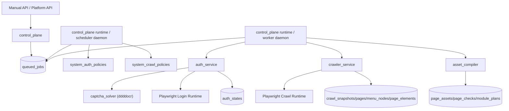

# 后端认证与采集运行闭环设计

**日期：** 2026-04-02  
**作者：** Codex  
**状态：** Draft

---

## 1. 文档定位

本文档定义当前后端阶段的认证刷新、验证码识别、事实采集、定时调度、worker 执行闭环设计，用于解决以下已确认问题：

- `crawl` API 只写入 `queued_jobs`，没有常驻 worker 实际消费任务
- 当前 `crawler_service` 只有空 extractor，占位成功但不会采回页面、菜单、按钮元素
- 测试系统 1 页面可以打开，但登录包含滑块验证码，现有 Playwright 适配器会把“未完成验证”误归因为“页面无法加载”
- 系统需要默认支持 `无验证码`、`图形验证码`、`滑块验证码` 三类认证方式,验证码基于ddddocr框架实现识别，并为未来短信验证码预留接口
- 定时 `auth` 同步和定时 `crawl` 需要明确配置归属、扫描方式与审计模型

本文档只描述设计，不包含实现细节提交。设计继续遵守仓库中的核心约束：

- 检查资产是主模型
- Playwright 脚本是派生产物
- 正式执行统一走 `control_plane`
- 认证注入必须由服务端统一处理

---

## 2. 背景与问题归因

当前系统的主要缺口不是单点 bug，而是三类能力尚未接通：

### 2.1 作业受理已存在，但执行进程缺失

后端 API 已经可以创建 `auth_refresh`、`crawl`、`asset_compile`、`run_check` 类型的 `queued_jobs`。但当前仓库没有独立的常驻 worker 入口，也没有部署级 daemon 设计，因此人工调用 `crawl` 接口后，数据库里只会看到 `accepted` 状态作业。

### 2.2 采集骨架存在，但真实采集器缺失

`crawler_service` 当前默认挂接的是空实现 extractor：

- `NullRouterRuntimeExtractor`
- `NullDomMenuExtractor`

因此即使认证态存在、作业被消费，最终也不会产出真实页面、菜单和元素事实。

### 2.3 登录链路尚未支持验证码分流

现有 `BrowserLoginAdapter` 只支持：

- 打开登录页
- 填用户名
- 填密码
- 点击提交

`auth_type` 参数没有进入实际流程控制，因此无法正确区分：

- 页面打不开
- 登录表单缺失
- 图形验证码识别失败
- 滑块验证未通过
- 登录成功但未抓到有效认证态

这也是测试系统 1 被误判为“页面无法加载”的根因。

---

## 3. 目标与非目标

### 3.1 第一版目标

本设计的第一版目标如下：

1. 建立可长期运行的 `scheduler daemon` 与 `worker daemon`
2. 打通手动 `auth:refresh` 与手动 `crawl` 的正式执行闭环
3. 为 `auth_service` 引入验证码识别抽象，默认实现基于 `ddddocr`
4. 首批认证模式支持：
   - `none`
   - `image_captcha`
   - `slider_captcha`
5. 为 `sms_captcha` 预留接口和配置位，但第一版不接真实短信通道
6. 让 `crawler_service` 产出真实事实层数据：
   - `crawl_snapshots`
   - `pages`
   - `menu_nodes`
   - `page_elements`
7. 让系统级定时 `auth` 同步和系统级定时 `crawl` 可配置、可扫描、可审计
8. `crawl` 仍按 `system` 级调度，但支持 `full | incremental` 策略位

### 3.2 非目标

第一版明确不做以下内容：

- 不直接调度孤立 Playwright 脚本文本作为平台主链
- 不把短信验证码网站接入正式执行流程
- 不把验证码识别逻辑泄露给 `crawler_service` 或 `runner_service`
- 不从 `page_elements` 反向推导调度对象
- 不在 FastAPI 生命周期里内嵌 worker 与 scheduler 主循环

---

## 4. 方案选择与结论

### 4.1 备选方案

本次评估了三种运行架构：

#### 方案 A：独立 `scheduler daemon` + 独立 `worker daemon`

- API 与 `control_plane` 只负责受理与入队
- `scheduler daemon` 负责扫描数据库策略并投递 `queued_jobs`
- `worker daemon` 负责消费 `queued_jobs`

优点：

- 符合当前五个子域边界
- 最容易解释和观测作业状态
- 便于后续扩展并发 worker、故障恢复和部署拓扑

缺点：

- 需要补两个长跑进程入口与运维说明

#### 方案 B：将调度与 worker 循环嵌入 FastAPI 进程

优点：

- 部署看起来最少

缺点：

- 多副本部署时容易重复扫描和重复执行
- 热重载、异常恢复、资源隔离都不清晰
- 与“control plane 受理、正式执行由后端统一控制”边界不一致

#### 方案 C：外部 cron 调 API，worker 独立运行

优点：

- 初期实现门槛较低

缺点：

- 业务配置分散在 `.env`、系统 crontab、数据库多处
- 审计链不完整
- 不利于后续平台化治理

### 4.2 推荐结论

采用 **方案 A**：

- 新增独立 `scheduler daemon`
- 新增独立 `worker daemon`
- API 只负责手动触发和策略管理
- 自动触发统一由 `scheduler daemon` 完成
- 正式执行统一由 `worker daemon` 完成

这里的 `scheduler daemon` 与 `worker daemon` 虽然是独立进程，但在架构归属上仍属于 `control_plane` 的运行面。它们不是新的业务子域，只是 `control_plane` 在后台的受控执行载体，用于保持“只有 `control_plane` 可以跨域编排”的约束。

---

## 5. 总体架构



架构约束保持如下：

- `control_plane` 仍然是唯一跨域编排入口
- `scheduler daemon` 与 `worker daemon` 属于 `control_plane` 的后台运行面，不构成独立跨域子域
- `auth_service` 负责认证刷新与认证态生成，不做页面识别
- `crawler_service` 只负责事实采集，不直接执行正式检查
- `asset_compiler` 只把事实编译为资产
- `runner_service` 只执行被批准的 `page_check/module_plan`

---

## 6. 数据模型设计

### 6.1 新增调度策略模型

第一版新增两类系统级策略对象：

#### `system_auth_policies`

用于描述某个系统的认证刷新策略。

建议字段：

- `id`
- `system_id`
- `enabled`
- `state`：`active | paused`
- `schedule_expr`
- `auth_mode`：`none | image_captcha | slider_captcha | sms_captcha`
- `captcha_provider`：第一版默认 `ddddocr`
- `captcha_config_json`
- `max_retry`
- `last_triggered_at`
- `last_succeeded_at`
- `last_failed_at`
- `last_failure_message`
- `created_at`
- `updated_at`

#### `system_crawl_policies`

用于描述某个系统的采集调度策略。

建议字段：

- `id`
- `system_id`
- `enabled`
- `state`：`active | paused`
- `schedule_expr`
- `crawl_scope`：`full | incremental`
- `framework_hint`
- `max_pages`
- `last_triggered_at`
- `last_succeeded_at`
- `last_failed_at`
- `last_failure_message`
- `created_at`
- `updated_at`

### 6.2 现有模型复用与扩展

现有统一作业入口仍然保持为 `queued_jobs`，但 payload 需要扩展策略审计字段：

- `auth_refresh` payload 增加：
  - `policy_id`
  - `trigger_source`
- `crawl` payload 增加：
  - `policy_id`
  - `trigger_source`
  - `crawl_scope`

### 6.3 配置权属

采用“环境变量 + 数据库混合”的明确划分：

`.env` 负责进程级配置：

- `WORKER_POLL_INTERVAL_MS`
- `SCHEDULER_SCAN_INTERVAL_MS`
- `AUTH_SCHEDULER_ENABLED`
- `CRAWL_SCHEDULER_ENABLED`
- `SCHEDULER_BATCH_SIZE`
- `PLAYWRIGHT_HEADLESS`
- `DDDDOCR_ENABLED`

数据库负责业务级策略：

- 每个 `system` 是否启用定时认证
- 每个 `system` 的 `auth_mode`
- 每个 `system` 的 cron 配置
- 每个 `system` 的 crawl 范围和最大采集页数

该切分保证：

- 部署行为由环境控制
- 业务策略可审计、可查询、可变更

---

## 7. 认证与验证码设计

### 7.1 组件边界

验证码逻辑必须收敛在 `auth_service` 内部，不允许泄露到 `crawler_service`、`asset_compiler`、`runner_service`。

建议新增以下抽象：

- `CaptchaSolver`
- `CaptchaChallenge`
- `CaptchaSolution`

其中：

- `AuthService` 负责读取系统凭证、调起浏览器登录、校验并持久化 `AuthState`
- `BrowserLoginAdapter` 负责登录状态机编排
- `CaptchaSolver` 负责验证码识别和滑块偏移计算

### 7.2 默认实现

第一版默认实现为 `DdddOcrCaptchaSolver`。

能力范围：

- 图形验证码：
  - 截图验证码区域
  - 调用 `ddddocr` 识别文本
  - 回填验证码输入框
- 滑块验证码：
  - 截图背景图和滑块图
  - 调用 `ddddocr` 计算目标偏移
  - 由 Playwright 执行拖拽动作
- 短信验证码：
  - 接口保留
  - 第一版返回 `not_implemented`

### 7.3 登录状态机

当前一次性 `fill/fill/click` 的登录流程需要升级为显式状态机：

1. 打开登录页
2. 等待登录壳加载
3. 填用户名和密码
4. 检测验证码类型
5. 按 `auth_mode` 进入对应分支：
   - `none`
   - `image_captcha`
   - `slider_captcha`
   - `sms_captcha`
6. 提交登录
7. 等待登录成功信号
8. 在浏览器上下文内采集 `storage_state`
9. 校验认证态非空后仅以服务端受控形态持久化 `AuthState`
10. 后续运行时只允许服务端把认证态注入 Playwright context，不作为上层通用 API 输出

### 7.4 认证态持有与注入约束

第一版必须显式满足以下安全边界：

- 完整 `storage_state` 只允许服务端内部持有和消费
- 持久化后的 `AuthState` 视为敏感运行时数据，不写入通用日志，不透传到通用结果载荷
- 对外 API 不返回完整 `storage_state`
- 已持久化的 `AuthState` 仅作为服务端运行时注入源，不作为技能、MCP 或上层调用方的通用输出
- `runner_service` 和 `crawler_service` 只接收“由服务端注入后的浏览器上下文”，不自行决定认证获取方式

### 7.5 错误分类

以后不再把所有登录失败都表述为“页面无法加载”。第一版需要支持明确错误分类：

- `page_open_failed`
- `login_form_not_found`
- `captcha_detect_failed`
- `captcha_solve_failed`
- `login_submit_failed`
- `auth_state_empty`
- `unsupported_auth_mode`

### 7.6 重试与回退

本次已确认采用“自动优先，预留人工/外部服务回退接口”的策略：

- 第一版实际落地 `ddddocr` 自动识别
- 图形验证码和滑块验证码支持受控重试
- 失败后落 `retryable_failed`
- 预留人工或第三方打码接口，但第一版不接真实外部服务

---

## 8. 采集设计

### 8.1 采集目标

`crawler_service` 的目标是从已登录上下文中获取事实层数据，而不是直接生成执行脚本。

第一版必须产出：

- 页面事实 `pages`
- 菜单事实 `menu_nodes`
- 元素事实 `page_elements`

### 8.2 extractor 分层

建议保留现有两个 extractor 边界，但由空实现替换为真实实现：

#### `RouterRuntimeExtractor`

职责：

- 优先读取前端 runtime/router 暴露信息
- 检测框架与路由特征
- 在拿不到 runtime 数据时，退化为 URL + 菜单归纳
- 输出 `PageCandidate`

#### `DomMenuExtractor`

职责：

- 基于稳定定位策略采集菜单树
- 逐步进入目标页面
- 采集页面核心元素
- 输出 `MenuCandidate` 与 `ElementCandidate`

### 8.3 采集流程

第一版流程建议如下：

1. 读取系统最新有效 `AuthState`
2. 使用服务端认证态打开 Playwright context
3. 进入首页并等待基础壳加载
4. 采集一级/二级菜单
5. 根据 `crawl_scope` 进行页面遍历
6. 每个页面执行稳定等待
7. 提取页面标题、路由、菜单归属、核心元素
8. 持久化 `crawl_snapshot/pages/menu_nodes/page_elements`
9. `crawler_service` 返回 crawl 结果摘要
10. 由 `control_plane` 运行面中的 `CrawlJobHandler` 判定成功并追加 `asset_compile`

这里要明确：

- `crawler_service` 只负责采集事实与返回结果
- 追加 `asset_compile` 属于跨域编排，只能由 `control_plane` 负责

### 8.4 元素采集范围

第一版仅采集支持资产编译的稳定元素子集：

- 按钮
- 输入框
- 表格
- 查询表单
- 弹窗触发按钮
- 标签页切换项
- 分页器

### 8.5 定位策略约束

定位策略遵循稳定性优先级：

1. `role`
2. 可见文本
3. `aria-*` / `data-*` / 语义属性
4. 稳定结构定位

明确禁止：

- 动态 ID 作为主定位依据

### 8.6 `full | incremental`

第一版按系统级策略执行：

- `full`
  - 完整遍历菜单树和可达页面
- `incremental`
  - 仍然以菜单遍历为主
  - 通过 `max_pages`、起始菜单、历史结构哈希等方式缩小范围
  - 第一版不做复杂的智能 diff 驱动调度

### 8.7 采集质量与失败语义

第一版需要明确“空结果成功”和“实质失败”的差异。

建议为 `crawl_snapshots` 扩充或配套持久化：

- `degraded`
- `failure_reason`
- `warning_messages`

典型值：

- `auth_state_missing`
- `menu_not_found`
- `page_navigation_unstable`
- `element_extraction_partial`

---

## 9. Worker 与 Scheduler 设计

### 9.1 `worker daemon`

`worker daemon` 是 `control_plane` 的后台运行进程，只负责消费统一作业队列并调用各域服务。

第一版职责：

- 循环轮询 `queued_jobs.status=accepted`
- 调用对应 handler：
  - `AuthRefreshJobHandler`
  - `CrawlJobHandler`
  - `AssetCompileJobHandler`
  - `RunCheckJobHandler`
- 记录状态流转、失败原因和结果摘要

第一版约束：

- 先支持单 worker 进程
- 支持空轮询 sleep
- 支持优雅退出
- 输出可观测日志

并发预留：

- 当前 `run_once()` 只有按时间取第一条的语义
- 后续多 worker 并发时，需要改为带抢占的领取模型，例如 `FOR UPDATE SKIP LOCKED` 或显式 claim 机制
- 第一版 spec 先保留该扩展约束，但不强行在本轮设计里引入复杂分布式协调

### 9.2 `scheduler daemon`

`scheduler daemon` 是 `control_plane` 的后台运行进程，只负责扫描策略并投递作业，不直接执行浏览器动作。

内部拆成两个扫描器：

- `auth policy scanner`
- `crawl policy scanner`

每轮扫描逻辑：

1. 从 `.env` 读取扫描器开关和扫描周期
2. 拉取数据库中 `enabled + active` 的策略
3. 判断 cron 是否命中
4. 检查该分钟是否已投递
5. 生成 `auth_refresh` 或 `crawl` 作业
6. 更新策略最近触发时间

### 9.3 与 `published_jobs` 的关系

已有 `published_jobs` 调度属于执行层和脚本层。

本次新增的：

- `system_auth_policies`
- `system_crawl_policies`

属于系统接入与事实采集层。

两类调度可以共享：

- cron 匹配函数
- 同分钟去重辅助逻辑

但不应混用同一张业务表，否则会破坏层次边界。

---

## 10. API 与管理面设计

第一版建议补充系统级策略管理接口：

- `GET /systems/{system_id}/auth-policy`
- `PUT /systems/{system_id}/auth-policy`
- `GET /systems/{system_id}/crawl-policy`
- `PUT /systems/{system_id}/crawl-policy`

继续保留手动触发接口：

- `POST /systems/{system_id}/auth:refresh`
- `POST /systems/{system_id}/crawl`

必要时可补测试/运维接口：

- `POST /internal/scheduler/tick`

但该接口仅用于调试和验收，不作为主触发链路。

---

## 11. 数据流与时序

### 11.1 手动认证刷新

```text
API -> control_plane -> enqueue auth_refresh
    -> control_plane runtime / worker daemon -> auth_service
    -> browser login + captcha solver
    -> auth_states
```

### 11.2 手动采集

```text
API -> control_plane -> enqueue crawl
    -> control_plane runtime / worker daemon -> crawler_service
    -> crawl_snapshots/pages/menu_nodes/page_elements
    -> CrawlJobHandler enqueue asset_compile
```

### 11.3 定时认证刷新

```text
scheduler daemon (control_plane runtime) -> scan system_auth_policies
    -> enqueue auth_refresh
    -> control_plane runtime / worker daemon -> auth_service
```

### 11.4 定时采集

```text
scheduler daemon (control_plane runtime) -> scan system_crawl_policies
    -> enqueue crawl
    -> control_plane runtime / worker daemon -> crawler_service
    -> CrawlJobHandler enqueue asset_compile
```

---

## 12. 测试与验收设计

### 12.1 单元测试

覆盖以下对象：

- `CaptchaSolver` 的图形验证码与滑块验证码分支
- `BrowserLoginAdapter` 登录状态机
- `CrawlerService` 的结果合并与降级语义
- `scheduler daemon` 的 cron 命中与同分钟去重
- `worker daemon` 的状态流转

### 12.2 集成测试

覆盖以下主链路：

- 手动 `auth:refresh` 可写入有效 `AuthState`
- 手动 `crawl` 可落 `crawl_snapshot/pages/menu_nodes/page_elements`
- crawl 成功后自动追加 `asset_compile`
- scheduler 到点后能投递 `auth_refresh` 与 `crawl`

### 12.3 浏览器适配测试

针对 `ddddocr + Playwright` 单独覆盖：

- 图形验证码图片识别
- 滑块偏移识别
- 失败重试
- 登录成功后抓取 `storage_state`

### 12.4 手工验收

使用 `docs/base_info.md` 中的两个测试系统：

#### 测试系统 1

- 地址：`https://ele.vben.pro`
- 预期：页面可打开，通过ddddocr实现 滑块验证码 验证并登录
- 验收标准：系统能识别为 `slider_captcha`，进入自动求解或返回明确的 `retryable_failed`

#### 测试系统 2

- 地址：`http://61.144.35.2:18804`
- 预期：`none` 验证码模式下完成认证与采集

### 12.5 数据验收

验收时至少检查以下表：

- `queued_jobs`
- `auth_states`
- `crawl_snapshots`
- `pages`
- `menu_nodes`
- `page_elements`
- `page_assets`
- `page_checks`

---

## 13. 成功标准

当满足以下条件时，可认为第一版设计目标已达成：

1. 手动 `auth:refresh` 能完成正式执行
2. 手动 `crawl` 能采回真实事实层数据
3. 定时 `auth` 能根据策略自动入队
4. 定时 `crawl` 能根据策略自动入队
5. `none`、`image_captcha`、`slider_captcha` 三种认证模式都有明确处理路径
6. `ddddocr` 成为默认验证码求解实现
7. 短信验证码仅保留接口，不进入正式验收闭环

---

## 14. 实施建议

建议后续实施顺序如下：

1. 先补策略模型、策略 API 和 daemon 启动入口
2. 再补 `auth_service` 的验证码抽象与 `ddddocr` 接入
3. 然后补真实 `crawler_service` extractor
4. 最后补 scheduler/worker 集成验证、手工验收与文档

该顺序可以先解决“作业不执行”和“验证码链路缺失”的阻塞项，再逐步把事实采集和自动调度闭环补全。
