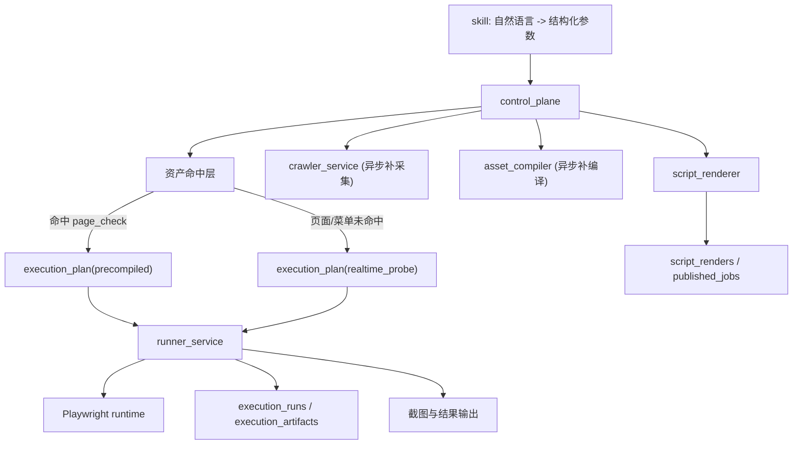

# 后端检查执行与受控实时探测设计

**日期：** 2026-04-03  
**作者：** Codex  
**状态：** Draft

---

## 1. 文档定位

本文档定义当前后端围绕“企业级 To B Web 系统业务仿真巡检与测试”的下一阶段演进设计，聚焦以下问题：

- `skill` 已负责把自然语言转成结构化调用参数，但后端仍不能稳定返回完整的执行结果与截图
- `check_request` 当前虽然区分了 `precompiled` 与 `realtime`，但 `realtime` 轨道实际不可执行
- 页面或菜单未命中时，系统缺少受控降级能力，导致采集链路的小缺陷会放大为整条检查链路失败
- `runner_service` 当前只能执行有限的确定性模块，尚未成为“可执行、可截图、可审计、可解释”的完整受控执行器
- 资产编译、正式执行、脚本渲染、调度固化四条链路已经具备骨架，但还没有围绕“资产优先 + 页面级受控降级”的原则形成真正闭环

本文档只讨论后端，不讨论 CLI、Skills、MCP 或前端实现细节。设计继续遵守仓库中的核心约束：

- 检查资产是主模型
- Playwright 脚本是派生产物
- 正式执行统一走 `control_plane`
- 认证注入必须由服务端统一处理

---

## 2. 背景与问题归因

### 2.1 目标产品形态

目标平台面向企业级 To B Web 系统，支持两类核心使用方式：

1. 用户通过自然语言表达检查意图，由 `skill` 解析为结构化参数，后端执行检查并返回结果与截图
2. 用户在一次有效检查链路基础上，将检查固化为平台调度对象，进行定时巡检或测试

这要求后端不仅能“跑一次检查”，还要具备以下能力：

- 把结构化请求映射到可执行资产
- 在资产不完整时进行受控降级
- 产出可消费的执行结果与截图工件
- 将检查对象沉淀为可调度资产，而不是孤立脚本文本

### 2.2 当前后端的真实状态

当前后端已经具备以下基础：

- `control_plane` 已支持结构化检查请求受理
- `crawler_service` 已支持事实快照采集
- `asset_compiler` 已支持从快照编译 `page_asset/page_check/module_plan`
- `runner_service` 已支持按 `module_plan` 执行部分确定性模块
- `script_renderer` 已支持从 `page_check` 派生 Playwright 脚本
- `published_job` 与调度运行时已具备基础模型和触发骨架

但这些能力之间还没有形成满足业务目标的闭环，关键断点集中在三个方面：

1. **降级轨道是空的**  
   当前 `control_plane` 会在资产未命中时把请求标记为 `realtime`，但 worker 实际会直接跳过该任务，说明“受控实时探测”只有概念，没有实现。

2. **运行器仍偏轻量**  
   当前 `runner_service` 能返回 `step_results`，但还不能稳定产出截图、最终 URL、页面标题、失败分类、运行上下文等企业级巡检所需结果。

3. **资产与运行能力未完全对齐**  
   编译器可以生成某些标准检查和模块计划，但 runtime 未必都支持，导致“可编译但不可正式执行”的不一致状态。

### 2.3 关键产品判断

本次设计确认以下产品规则：

- 自然语言解析继续由 `skill` 负责，后端只接收结构化参数
- 正式执行真相继续保持为 `page_check + module_plan + runtime_policy`
- 页面或菜单未命中时，允许后端走一次受控实时探测
- 页面已经命中，但页面内关键元素资产缺失时，直接失败，不走自由脚本兜底
- Playwright 脚本继续只作为派生产物，而不是正式执行主链

这个判断决定了后端的演进方向不是“实时生成脚本平台”，而是“资产优先的受控执行平台”。

---

## 3. 设计目标与非目标

### 3.1 主要目标

本阶段的后端设计目标如下：

1. 让结构化检查请求形成真正可用的双轨执行模型：
   - `precompiled`
   - `realtime_probe`
2. 将 `runner_service` 扩展为完整受控执行器，统一产出：
   - 结构化结果
   - 截图 artifacts
   - 失败分类
   - 运行上下文
3. 建立“页面/菜单缺失可降级，元素缺失直接失败”的稳定后端判断边界
4. 保持 `script_renderer` 为派生产物层，不回到正式执行主链
5. 让一次成功检查能够自然过渡到资产调度对象，而不是要求用户维护孤立脚本

### 3.2 次要目标

- 提升资产命中层的鲁棒性，降低因页面别名、菜单文案或 route 轻微变化导致的误失配
- 让 runtime probe 的成功结果可以反哺 alias 或补采集信号
- 保持后端结果模型足够稳定，使上层 `skill`、MCP、前端都能消费同一结果对象

### 3.3 非目标

本次设计明确不做以下内容：

- 不让后端直接解析自然语言
- 不让 `skill` 负责正式执行细节、认证注入或脚本真相
- 不把自由 Playwright 脚本文本提升为系统唯一真相
- 不允许在页面元素缺失时走无边界的自由 runtime 推理
- 不让 `runner_service` 成为跨域编排中心

---

## 4. 方案比较与推荐

### 4.1 方案 A：严格资产优先，未命中即失败

执行规则：

- 页面、菜单、元素任意一环未命中，统一失败

优点：

- 结构最简单
- 边界最纯粹
- runtime 最容易保持 deterministic

缺点：

- 对 crawler 和 compiler 完整度过于敏感
- 任何页面/菜单漏采都会直接打穿用户体验
- 不适合企业真实系统中的轻微漂移和采集噪声

### 4.2 方案 B：资产优先 + 页面级受控实时探测

执行规则：

- 已命中 `page_check` 时，直接走预编译轨
- 页面或菜单未命中时，允许走一次受控实时探测
- 页面已命中但元素资产缺失时，直接失败

优点：

- 保住“资产是主模型”的原则
- 对采集链路的小缺陷更具韧性
- 不会退化成自由脚本平台
- 更适合企业级巡检的稳定性要求

缺点：

- 后端需要额外补一条受控 probe 轨道
- 控制面和结果模型需要能区分两种轨道

### 4.3 方案 C：实时生成 Playwright 脚本并执行

执行规则：

- 一旦资产未命中或资产不完整，就实时生成脚本并执行

优点：

- 表面成功率可能更高
- 对长尾页面更灵活

缺点：

- 正式执行真相会退回到脚本文本
- 认证、审计、版本治理边界会被削弱
- 更容易产生不可解释、不可复现的问题
- 长期会背离平台化治理方向

### 4.4 推荐结论

采用 **方案 B**：

- 正式执行主轨仍然是 `precompiled`
- 仅在页面/菜单未命中时进入 `realtime_probe`
- 元素资产缺失一律视为需要补采集/补编译，不做自由运行时兜底

这是安全性、性能、长期治理和短期可用性之间的最平衡方案。

---

## 5. 总体架构与职责边界

### 5.1 `skill`

职责：

- 负责把自然语言解析为结构化调用参数
- 不负责正式执行
- 不负责认证注入
- 不负责生成正式执行真相

### 5.2 `control_plane`

职责：

- 接收结构化检查请求
- 归一化 `system_hint/page_hint/check_goal`
- 判断走 `precompiled` 还是 `realtime_probe`
- 决定是否触发补采集、补编译或补 alias
- 对外输出统一任务状态与执行结果

它仍然是唯一允许跨域编排的中心域。

### 5.3 `crawler_service`

职责：

- 只负责事实采集
- 不直接承担单次正式检查的页面级探测执行

说明：

本设计中的 `realtime_probe` 不等同于 `crawl`。  
`crawl` 是批量事实采集，`realtime_probe` 是单次请求下的受控页面级探测。

### 5.4 `asset_compiler`

职责：

- 只负责把事实快照编译成资产
- 维护 `page_asset/page_check/module_plan/intent_alias`
- 不直接承担正式执行

### 5.5 `runner_service`

职责：

- 接收被批准的执行计划
- 统一注入认证并驱动 Playwright runtime
- 执行 `module_plan` 或 `probe_plan`
- 产出结构化结果、截图、失败分类、审计上下文

这意味着 `runner_service` 必须从“轻量执行器”演进为“完整受控执行器”。

### 5.6 `script_renderer`

职责：

- 从 `page_check + module_plan` 派生稳定 Playwright 脚本
- 服务于发布、导出和审计

限制：

- 不得重新成为正式执行主链的唯一真相

---

## 6. 双轨执行设计

### 6.1 结构化请求入口

后端继续只接收结构化参数，例如：

- `system_hint`
- `page_hint`
- `check_goal`
- `strictness`
- `time_budget_ms`
- `request_source`

自然语言解释不进入后端执行域。

### 6.2 命中顺序

`control_plane` 应保持以下命中顺序：

1. `systems`
2. `intent_aliases`
3. `page_assets`
4. `page_checks`

补充规则：

- 如果系统未命中，直接失败
- 如果页面或菜单未命中，允许进入 `realtime_probe`
- 如果页面已命中，但没有匹配 `page_check` 且缺失原因属于元素资产缺失，则直接失败

### 6.3 `precompiled` 轨道

进入条件：

- 已命中 `page_check`
- 对应 `module_plan` 可执行
- 资产状态允许正式执行

执行真相：

- `page_check`
- `module_plan`
- `runtime_policy`
- 服务端注入认证

该轨道是平台默认主轨。

### 6.4 `realtime_probe` 轨道

进入条件：

- 系统已命中
- 页面或菜单未命中
- 请求目标属于允许降级的页面级检查

允许能力：

- 页面 route 探测
- 菜单链探测
- 页面打开检查
- 页面 ready 检查
- 页面级截图

禁止能力：

- 不允许元素级自由推理
- 不允许自由生成复杂跨页面业务脚本
- 不允许把临时 probe 结果直接当作正式资产真相

### 6.5 失败分流

后端需要明确区分以下失败类型：

- `system_not_found`
- `page_or_menu_not_resolved`
- `element_asset_missing`
- `auth_blocked`
- `navigation_failed`
- `page_not_ready`
- `assertion_failed`
- `runtime_error`

只有在能够区分这些失败类型后，产品规则才可稳定落实。

---

## 7. 运行时执行器设计

### 7.1 执行器定位

`runner_service` 的职责不应再停留在“按步骤调用几个 runtime 方法”。  
它需要成为一个完整的受控执行器，至少统一承担以下工作：

- 认证注入
- 浏览器上下文初始化与关闭
- 步骤执行
- 页面级截图
- 运行耗时统计
- 结果持久化
- 失败分类
- 运行上下文归档

### 7.2 运行结果最小输出

每次执行至少输出：

- `execution_track`
- `auth_status`
- `asset_version`
- `execution_duration_ms`
- `failure_category`
- `final_url`
- `page_title`
- `step_results`
- `artifact_ids`
- `used_runtime_policy`
- `used_module_plan_id`
- `needs_recrawl`
- `needs_recompile`

### 7.3 截图工件

后端需要把截图视为正式执行结果的一部分，而不是临时调试附带产物。

建议至少支持：

- 页面级首图
- 失败现场图
- 必要时的步骤级截图

`execution_artifacts` 应可表达：

- `artifact_kind`
- `result_status`
- `artifact_uri`
- `payload`

并提供统一读取接口供上层消费。

### 7.4 runtime module 闭环

资产编译器能生成的标准检查和模块计划，runtime 必须具备相应执行能力。  
否则会出现“可编译、可渲染、不可正式执行”的不一致状态。

因此必须建立以下闭环约束：

- 编译器新增标准检查时，需要同步定义 runtime module 契约
- runtime 不支持的 module 不得进入正式 `page_check`
- `script_renderer` 与 `runner_service` 都必须对同一组 module 契约保持一致

---

## 8. 数据与 API 演进建议

### 8.1 执行模型补充

建议补强以下执行层语义：

- `execution_plan.execution_track` 明确区分 `precompiled` 与 `realtime_probe`
- `execution_run.failure_category` 需要真正写入
- `execution_run.duration_ms` 需要记录真实值
- `execution_artifact` 需要承载截图与运行上下文

### 8.2 结果查询模型

当前仅有“请求状态查询”不足以支撑业务结果消费。  
需要一个统一结果视图，至少包含：

- 请求状态
- 执行轨道
- 执行结果
- 失败原因
- 截图列表
- 关键步骤结果
- 是否触发了 probe
- 是否建议补采集/补编译

### 8.3 alias 与补采集信号回写

当 `realtime_probe` 成功解析出页面 route 或菜单链时，后端应支持回写以下信息：

- 新的 `intent_alias`
- 新的 `route_hint`
- `needs_recrawl`
- `needs_recompile`

这样系统可以把一次运行时补定位逐步沉淀回资产体系。

---

## 9. 脚本生成与调度固化设计

### 9.1 脚本生成原则

Playwright 脚本仍然是派生产物，不是正式执行真相。  
因此脚本生成应遵循：

- 来源于 `page_check + module_plan`
- 绑定 `asset_version`
- 绑定 `auth_policy`
- 绑定 `runtime_policy`

### 9.2 何时生成脚本

脚本只应用于以下场景：

1. 用户显式导出或查看脚本
2. 将某个检查对象发布为外部可运行工件
3. 审计或回溯某次资产版本对应的可执行文本

### 9.3 调度主对象

平台主调度对象仍应是：

- `page_check`
- `asset_version`
- `runtime_policy`

而不是一段孤立脚本文本。

### 9.4 从检查到调度的晋升路径

后端需要支持以下自然固化路径：

1. 用户发起结构化检查
2. 后端成功执行并返回结果
3. 用户确认要长期调度
4. 后端基于当前 `page_check + asset_version + runtime_policy` 生成 `published_job`

这样“检查”和“调度”是连续产品链路，而不是两段割裂流程。

---

## 10. 性能与效率判断

本节用于回答“该方案与实时生成 Playwright 脚本相比，在性能和效率上差异如何”。

### 10.1 基本判断

对企业级 To B 巡检平台而言，`资产优先 + 页面级受控降级` 的总体效率优于“每次都实时生成脚本并执行”。

原因不在于脚本文本生成本身，而在于后者通常会多出：

- 页面探测
- 导航规划
- 定位选择
- 脚本拼装
- 额外重试与失败解释

### 10.2 相对量级估算

在不考虑极端复杂页面的情况下，可以按相对量级理解：

- `precompiled`：基线 `1.0x`
- `realtime_probe`：约 `1.2x - 1.8x`
- `实时生成完整 Playwright 脚本并执行`：约 `1.5x - 3x`

复杂页面、弱网环境、动态菜单和高噪声前端中，这个差距通常还会放大。

### 10.3 长期平台收益

相比实时生成脚本，推荐方案在以下方面更优：

- 更低的平均时延
- 更低的执行不确定性
- 更强的审计性
- 更容易调度治理
- 更容易将一次成功运行沉淀为长期资产

因此该方案更适合作为企业级 To B 巡检与测试平台的正式后端架构。

---

## 11. 与现有架构的一致性评估

### 11.1 一致性结论

本次演进方向与当前后端总架构不存在致命冲突。  
它不是架构反转，而是把既有设计中已经声明但尚未落地的能力补实。

### 11.2 不变的架构原则

以下原则在本次演进中保持不变：

- 自然语言解释留在 `skill`
- 正式执行统一走 `control_plane`
- 认证注入由服务端统一处理
- `script_renderer` 继续只是派生产物层
- 平台主调度对象继续是资产和检查，而不是孤立脚本

### 11.3 需要严格防止的跑偏

实现过程中必须防止以下三种跑偏：

1. 把 `realtime_probe` 做成自由脚本生成器
2. 把 `runner_service` 做成跨域编排中心
3. 把 `script_renderer` 拉回正式执行主链

只要守住这三条边界，本次演进就是健康增强，而不是结构性偏航。

---

## 12. 结论

从企业级 To B 产品目标出发，当前整体架构足以成为“基于 AI 与采集资产实现 Web 系统业务仿真巡检与测试平台”的正确后端底座。

它满足这一目标的前提是：

- `skill` 只负责自然语言到结构化参数的转换
- 后端坚持资产优先
- 页面/菜单未命中时允许受控页面级降级
- 页面内元素缺失时直接失败并要求补采集/补编译
- `runner_service` 被补齐为真正的完整受控执行器
- Playwright 脚本继续只是派生产物

因此，下一阶段的最小正确后端闭环应是：

1. 实现可执行的 `realtime_probe`
2. 补齐完整运行结果与截图输出
3. 打通失败分类与补采集信号
4. 对齐 runtime module 与资产编译器
5. 打通从一次成功检查到调度固化的后端晋升路径

在该闭环完成之前，后端仍属于“架构方向正确，但执行能力未闭环”的状态；在该闭环完成之后，平台才真正具备企业级 To B 业务仿真巡检与测试的后端基础能力。
