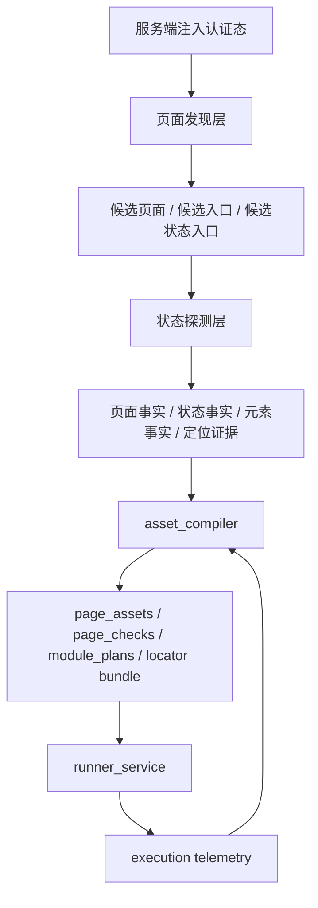

# 后端 Vue/React Web 系统采集完整性增强设计

**日期：** 2026-04-03  
**作者：** Codex  
**状态：** Draft

---

## 1. 文档定位

本文档定义当前项目面向 Vue、React 构建的企业级 Web 系统时，如何提升事实采集的正确性与完整性，重点解决以下问题：

- 当前 `crawler_service` 主要依赖运行时路由提示、DOM 菜单遍历和可见元素抓取，对 SPA 的懒加载、条件渲染、Tabs、弹窗、折叠区等状态覆盖不足
- 采集链路更偏“启发式抽取”，尚未形成“页面发现高召回、状态探测高精度”的分层策略
- 当前事实层主要保存单一 `playwright_locator`，难以应对 React/Vue 页面重渲染、组件库升级、局部结构漂移带来的定位不稳定问题
- 系统缺少一套可验证的“采集完整性”评估口径，无法持续判断增强后的采集是否真的更完整、更可编译、更可执行

本文档只讨论后端采集与资产编译侧设计，不讨论 CLI、MCP、前端页面和自然语言解析实现细节。设计继续遵守仓库中的核心约束：

- 检查资产是主模型
- Playwright 脚本是派生产物
- 正式执行统一走 `control_plane`
- 认证注入必须由服务端统一处理

---

## 2. 背景与问题归因

### 2.1 当前采集链路的真实能力边界

当前 `crawler_service` 已具备最小正式采集能力：

- 通过服务端注入的 `storage_state` 打开目标系统
- 从浏览器运行时抓取部分 route hints
- 从 DOM 提取菜单节点和可见关键元素
- 在 `full crawl` 下按发现到的 route 逐页访问并补抓元素

这条链路对结构较规整、首屏即可渲染的后台页面已经足够，但它本质上仍是“轻量运行时探测 + DOM 启发式抽取”。

### 2.2 Vue/React 系统导致漏采的主要原因

企业级 Vue/React 后台常见以下行为，它们都会让当前链路出现漏采或误采：

- 页面入口不完全暴露在当前 DOM，而是存在于运行时路由表、权限接口或懒加载模块中
- 同一路由下存在多个重要状态，但 URL 不变化，例如 Tabs、弹窗、抽屉、筛选展开、局部视图切换
- 元素只有在点击一级入口后才会 materialize，例如树节点展开、分页切换、二级菜单悬浮展开
- 虚拟列表、骨架屏、异步渲染和延迟挂载会让“当前可见 DOM”不是最终页面真相
- 组件库升级或局部改造后，单一 locator 容易老化

### 2.3 本次设计的范围判断

本次设计明确聚焦两类完整性：

1. `页面/菜单/关键元素` 完整
2. `页面状态与交互流` 完整

并进一步确认：

- 允许采集阶段执行受控、安全、非破坏性的交互动作
- 采用“页面/菜单高召回，元素与交互状态高精度”的采集策略
- 暂不把“完整前端内部运行时语义”作为第一阶段目标

---

## 3. 设计目标与非目标

### 3.1 设计目标

本阶段采集增强的设计目标如下：

1. 让 `crawler_service` 对 Vue/React 后台页面形成更高召回的页面发现能力
2. 让系统可以在不越过安全边界的前提下，对 Tabs、折叠区、弹窗、抽屉、分页首屏等页面状态做受控探测
3. 让事实层不仅保存单个 `playwright_locator`，还保存可编译成稳定 locator bundle 的定位证据集合
4. 让 `asset_compiler` 能把页面事实、状态事实和定位证据编译成更稳定的 `page_asset/page_check/module_plan`
5. 建立一套完整性、精度和可编译性的量化指标，用于驱动后续优化

### 3.2 非目标

本次设计明确不做以下事情：

- 不让 `crawler_service` 直接承担正式检查执行职责
- 不把弹窗、抽屉、Tab 状态一律提升为独立 `page_asset`
- 不在 `runner_service` 里做无限制 selector 试错
- 不把自由 Playwright 脚本文本重新提升为正式执行真相
- 不依赖动态 ID、随机 class hash 或纯位置型 selector 作为主定位策略
- 不在第一阶段追求“前端内部 store / 组件树 / 所有权限分支”的穷尽采集

---

## 4. 方案比较与推荐

### 4.1 方案 A：继续增强启发式采集

做法：

- 在现有路由提示脚本、DOM 菜单抓取脚本和可见元素脚本基础上，继续增加更多选择器、更多等待条件、更多框架全局变量探测和更多安全点击规则

优点：

- 改动最小
- 可以快速提升部分页面覆盖率
- 与当前事实层模型差异较小

缺点：

- 长期仍然依赖规则堆叠
- 不易解释“页面发现”和“状态探测”的职责边界
- 上限明显，对复杂 React/Vue 页面仍然容易漏

### 4.2 方案 B：框架感知页面发现 + 受控状态探测双引擎

做法：

- 新增“页面发现层”，以高召回方式汇总路由、导航、网络和入口信号
- 新增“状态探测层”，在单个页面内用受控交互补齐 Tabs、弹窗、折叠区、分页等代表状态
- 为每个页面、入口和关键元素采集定位证据，再由 `asset_compiler` 编译为 locator bundle

优点：

- 同时满足“页面/菜单高召回”和“元素/状态高精度”
- 更符合资产优先的长期治理方向
- 对 React/Vue 的异步渲染与局部状态更具韧性

缺点：

- 需要扩展事实层模型与编译链路
- 需要增加状态去重、交互预算和安全约束机制

### 4.3 方案 C：录制回放式采集

做法：

- 依赖人工或测试账号走一遍主要业务流，系统再从录制轨迹中反向抽取页面、状态和元素事实

优点：

- 对复杂业务系统的单次覆盖率很高

缺点：

- 强依赖人工覆盖，不 deterministic
- 不适合作为平台默认主模式
- 难以形成统一、稳定的资产真相

### 4.4 推荐结论

采用 **方案 B** 作为主路线，并吸收方案 A 的低成本增强手段；方案 C 只作为后续补盲工具，不进入平台默认主链。

推荐理由如下：

- 与当前系统“事实层 -> 资产层 -> 执行层”的主线兼容
- 能明确拆分页面发现与状态探测的责任
- 能把多重定位 fallback 收敛为资产能力，而不是运行时 improvisation
- 能在完整性和确定性之间取得可治理的平衡

---

## 5. 总体架构

架构边界保持如下：

- `crawler_service` 只负责事实采集，不承担正式执行
- `asset_compiler` 负责将页面、状态、元素和定位证据转成资产与 locator bundle
- `runner_service` 只消费已编译资产，不临时发明定位策略
- `control_plane` 继续是跨域编排入口，后续可基于采集质量与执行 telemetry 决定是否补采集或补编译

---

## 6. 页面发现层设计

页面发现层的职责是：**高召回找全可达页面与状态入口**，但不在此阶段决定最终执行策略。

### 6.1 输入与输出

输入：

- 已注入认证态的浏览器上下文
- `crawl_scope`
- 系统已有的 `framework_hint`

输出：

- 页面候选 `PageCandidate`
- 菜单候选 `MenuCandidate`
- 状态入口候选
- 页面入口候选
- 可达性验证元数据

### 6.2 主要信号源

页面发现层应并行汇总以下五类信号：

#### 6.2.1 路由信号

- Vue 路由运行时对象
- React Router 运行时 location / matches / route 注册信息
- `history.pushState/replaceState` 导航监听
- 当前页面中的 `<a href>`、面包屑、菜单路由属性

#### 6.2.2 导航骨架信号

- 左侧树菜单
- 顶部导航
- 二级悬浮菜单
- 面包屑
- 工作台卡片入口
- Tabs 形式的页面入口

#### 6.2.3 页面可达性信号

对候选路径做轻量访问确认，至少记录：

- `final_url`
- `page_title`
- `render_ready`
- `auth_redirected`
- `permission_denied`
- `skeleton_timeout`

#### 6.2.4 网络与资源信号

- 菜单配置接口
- 权限接口
- 路由配置接口
- 懒加载 chunk 请求与命名

这类信号只作为补盲来源，不能直接越过页面验证成为系统真相。

#### 6.2.5 状态入口信号

用于标记需要后续状态探测的入口：

- Tabs
- 折叠筛选
- 展开区
- 弹窗打开按钮
- 抽屉打开按钮
- 首屏分页切换
- 树节点展开
- 视图切换按钮

### 6.3 页面发现层的原则

- 页面发现追求高召回，允许一定冗余
- 页面入口与页面内状态入口必须区分建模
- 不能把所有入口都直接提升为独立页面
- 页面发现层只负责“找全”，不负责“跑深”

---

## 7. 状态探测层设计

状态探测层的职责是：**在受控、安全、可回放的边界内，补齐页面内主要状态，并把状态和元素绑定起来**。

### 7.1 受控动作白名单

仅允许执行以下非破坏性动作：

- `tab_switch`
- `expand_panel`
- `open_modal`
- `open_drawer`
- `toggle_view`
- `paginate_probe`
- `tree_expand`

明确禁止：

- 提交
- 删除
- 保存
- 发布
- 审批
- 导入导出
- 任意可能引发真实业务副作用的动作

### 7.2 状态节点模型

同一路由下允许存在多个状态节点，例如：

- 默认列表态
- 高级筛选展开态
- 新增弹窗打开态
- 指定 Tab 激活态
- 首个树节点展开态

每个状态节点应生成 `state_signature`，签名至少由以下稳定特征组成：

- 当前 route
- 主标题或区域标题
- 当前激活 Tab
- 打开的 modal/drawer 标题
- 关键表格列头
- 关键表单标签
- 主区域结构摘要

### 7.3 状态推进策略

状态探测默认采取“浅而广”的策略：

- 页面级入口优先于深层入口
- 先扩宽，再加深
- 每页动作数受预算约束
- 同类入口只选代表样本
- 新状态与已有状态相似度过高时停止下钻

目标不是穷尽所有组合，而是采出足以支撑资产编译的代表性状态集合。

### 7.4 元素入库原则

只有满足以下条件的元素，才进入高质量事实候选：

- 所在状态已经稳定渲染
- 元素可见且可交互
- 至少存在一个高质量定位证据
- 元素属于关键类型，例如按钮、输入、表格、分页、Tab、树、弹窗入口
- 元素具备明确上下文，例如页面标题、弹窗标题、Tab 名称

### 7.5 失败与降级分类

状态探测需要输出结构化失败原因，例如：

- `blocked_by_permission`
- `render_not_stable`
- `virtual_list_unmaterialized`
- `unsafe_action_rejected`
- `locator_ambiguous`
- `state_signature_duplicate`
- `interaction_budget_exhausted`

---

## 8. 多重定位策略与 locator bundle 设计

### 8.1 核心原则

多重定位 fallback 必须是**资产的一部分**，而不是运行时的临场试错。

采集阶段保存“定位证据”；`asset_compiler` 将证据编译成有顺序、有评分、有上下文约束的 locator bundle；`runner_service` 只按 bundle 回放。

### 8.2 采集阶段需要保存的定位证据

对每个菜单、关键元素和状态入口，建议至少保存：

- `semantic_locator`
- `label_locator`
- `testid_locator`
- `text_anchor_locator`
- `structure_locator`
- `url_context`
- `state_context`
- `dom_fingerprint`

### 8.3 编译阶段输出的 locator bundle

每个候选 locator 至少包含：

- `strategy_type`
- `selector`
- `context_constraints`
- `stability_score`
- `specificity_score`
- `observed_success_count`
- `fallback_rank`

推荐默认排序：

1. 语义定位：`role + accessible name`
2. `label/aria`
3. `data-testid/data-qa`
4. 文本 + 稳定容器锚点
5. 结构化定位
6. 受限 CSS fallback

### 8.4 禁止作为主策略的定位方式

- 动态 ID
- 纯 `nth-child`
- 过长 class 链
- 明显来源于运行时 hash 的 CSS class

### 8.5 运行时回放规则

`runner_service` 的运行时规则必须保持简单且确定：

1. 进入 `module_plan` 指定页面或状态
2. 按 locator bundle 顺序尝试候选
3. 命中后记录命中的 `strategy_type` 与 `fallback_rank`
4. 全部失败则返回结构化失败，不临时扩展新规则

运行失败应至少区分：

- `locator_all_failed`
- `context_mismatch`
- `state_not_reached`
- `element_became_hidden`
- `ambiguous_match`

### 8.6 反哺资产健康度

运行时 telemetry 应回写以下信号，用于反哺资产健康度：

- 主定位命中率
- fallback 命中率
- 命中候选 rank
- 歧义命中比例
- 某页面持续降级的趋势

这些数据可进一步驱动：

- 漂移评分
- 自动 recrawl / recompile 建议
- locator bundle 重排序

---

## 9. 数据模型与编译链路影响

### 9.1 事实层扩展方向

在不破坏现有主线的前提下，事实层需要从“页面 / 菜单 / 元素”三类对象，扩展为至少可表达：

- 页面候选
- 页面入口候选
- 状态入口候选
- 状态节点事实
- 元素定位证据

重点不是一次性引入大量新表，而是保证页面、状态、元素和定位证据之间的关联关系可以被编译层消费。

### 9.2 资产层扩展方向

`asset_compiler` 需要新增以下编译能力：

- 将状态节点识别为“页面内上下文”，而不是一律提升为独立页面
- 为 `page_check/module_plan` 注入页面状态进入步骤
- 将定位证据编译为 locator bundle
- 把 locator bundle 与 `page_check/module_plan` 绑定

### 9.3 与当前主链的兼容关系

增强后的主链仍保持：

`crawl facts -> asset compiler -> page_assets/page_checks/module_plans -> runner execution`

变化点在于：

- 事实层更丰富
- 编译层更智能
- 运行时更确定

而不是把正式执行重新拉回自由脚本。

---

## 10. 完整性评估指标

### 10.1 页面发现完整性

- `route_recall`
- `menu_coverage`
- `entry_coverage`
- `reachable_page_validation_rate`

目标是高召回，允许少量冗余，但不能漏主页面。

### 10.2 状态探测完整性

- `state_entry_discovery_rate`
- `state_materialization_rate`
- `representative_state_coverage`
- `state_duplication_rate`

目标是覆盖代表状态集合，而不是穷举所有组合。

### 10.3 元素质量指标

- `key_element_precision`
- `locator_primary_hit_rate`
- `locator_fallback_rate`
- `ambiguous_locator_rate`

目标是高精度，保证采到的关键元素可用于稳定资产编译和执行。

### 10.4 资产可编译性指标

- `page_to_asset_compile_rate`
- `asset_to_check_compile_rate`
- `module_plan_build_rate`
- `realtime_probe_fallback_rate`
- `post_crawl_recrawl_recompile_trigger_rate`

这组指标用于判断采集增强是否真正提高了平台主链价值。

---

## 11. 测试与验收设计

### 11.1 测试层次

建议按四层测试推进：

1. 提取器单元测试  
   验证路由、导航、状态入口、定位证据提取逻辑
2. 受控交互集成测试  
   在 Vben Admin、HotGo、DPM 等真实 Vue/React 后台上验证 Tabs、弹窗、折叠区、分页、树展开
3. 资产编译验收测试  
   验证采集事实可以稳定编译为 `page_assets/page_checks/module_plans`
4. 执行回归测试  
   验证 runner 优先命中主定位，fallback 可审计，且不会越界点击危险动作

### 11.2 第一阶段建议验收门槛

- 主导航页面覆盖率 `>= 95%`
- 代表状态覆盖率 `>= 80%`
- 关键元素 precision `>= 90%`
- 主定位命中率 `>= 85%`
- fallback 使用率呈下降趋势，而不是长期依赖 rank 3+ 候选

---

## 12. 实施边界与后续计划建议

本设计确认以下实施原则：

- 优先以小步、deterministic 的方式增强现有 `crawler_service`
- 先补页面发现与状态探测分层，再补更多框架专用探测
- 先让 locator bundle 成为资产事实，再考虑更复杂的执行期自适应
- 任何正式执行能力仍然统一走 `control_plane`

建议后续实施拆解优先顺序如下：

1. 抽象页面入口候选、状态入口候选与状态节点模型
2. 扩展页面发现层，补齐多源信号归并
3. 引入受控状态探测器与交互预算
4. 扩展事实层定位证据采集
5. 为 `asset_compiler` 引入 locator bundle 编译
6. 为 `runner_service` 引入 bundle 回放 telemetry
7. 建立完整性指标与真实站点回归基线

本文档到此只定义设计，不包含具体实现与迁移步骤。后续如进入实施，必须继续在 `docs/superpowers/plans/` 中补充对应实施计划。
