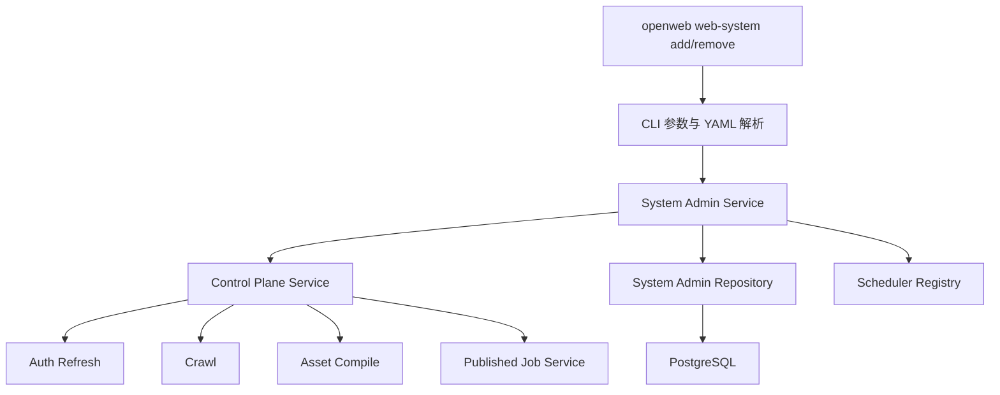

# Web 测试系统接入与删除治理设计

**日期：** 2026-04-03  
**作者：** Codex  
**状态：** Draft

---

## 1. 文档定位

本文档定义当前项目在“通过 CLI 接入一个新的 Web 测试系统，并彻底删除一个已接入测试系统”场景下的治理设计，重点解决以下问题：

- 当前仓库已有 `auth/crawl/asset compile/published job` 等正式能力，但没有“系统接入/系统删除”的统一治理入口
- 仅靠 CLI 参数无法稳定承载 `url/账号密码/验证码类型/选择器/调度策略` 等结构化配置
- 删除一个系统不是删除单张表，而是需要同时清理认证、采集、资产、执行、调度等整条链路的数据与运行时注册项
- 正式执行必须统一走 `control_plane`，不能为了方便接入或清理而绕过后端边界

本文档只讨论后端与 CLI 的接入/删除治理，不讨论前端、MCP、Skill 编排或自由 Playwright 脚本生成。设计继续遵守仓库中的核心约束：

- 检查资产是主模型
- Playwright 脚本是派生产物
- 正式执行统一走 `control_plane`
- 认证注入必须由服务端统一处理

---

## 2. 设计目标与非目标

### 2.1 主要目标

本次设计的主要目标如下：

1. 为 `cli` 增加受控的 `web-system add/remove` 命令
2. 用结构化 YAML 清单驱动系统接入，而不是把系统配置散落在命令参数里
3. 接入时通过正式链路完成：
   - `system/system_credentials`
   - `system_auth_policy/system_crawl_policy`
   - 一次真实 `auth refresh + crawl + asset compile`
   - 命中指定 `page_check`
   - 创建 `published_job`
4. 删除时彻底清理该系统相关数据库数据，并确保相关 APScheduler 任务全部移除
5. 保持 `cli` 只做命令入口，业务编排落在后端治理服务

### 2.2 已确认约束

本设计基于以下已确认决策：

1. `add` 通过 YAML 文件提供系统配置
2. YAML 中允许写明文 `username/password`
3. 入库前必须使用 `.env` 中定义的密钥加密，数据库不直接保存明文
4. `remove` 同时支持：
   - `--file`
   - `--system-code`
5. `remove` 的目标是**物理彻底清理**
   - 包括历史执行痕迹
   - 包括调度注册项
6. 本次接入测试对象使用 [`docs/base_info.md`](/Users/wangpei/src/singe/Runlet/docs/base_info.md) 中的“测试系统3”
7. 本次删除测试对象使用 [`docs/base_info.md`](/Users/wangpei/src/singe/Runlet/docs/base_info.md) 中的“测试系统1”
8. 接入后的默认发布目标为：
   - `check_goal=table_render`
   - `schedule_expr=*/30 * * * *`

### 2.3 非目标

本次设计明确不做以下内容：

- 不把 Markdown 文档直接作为运行时配置真相
- 不让 CLI 直接写数据库表绕过后端服务
- 不把接入对象退化成孤立 Playwright 脚本文本
- 不引入新的“系统治理 worker job”类型
- 不支持任意复杂的多系统批量编排，本次先解决单系统接入与单系统删除

---

## 3. 方案比较与推荐

### 3.1 方案 A：CLI 直接编排现有服务并直接清库

做法：

- CLI 直接读取 YAML
- CLI 自己调用各领域服务，删除时自己写 SQL 清理表

优点：

- 表面实现路径最短
- 新文件数量较少

缺点：

- 违反“`cli` 只做命令入口”的仓库约束
- 接入与删除规则会散落在 CLI
- 后续更难复用、测试和扩展

### 3.2 方案 B：新增后端治理服务，CLI 只做入口

做法：

- CLI 负责参数解析、文件加载、打印结果
- `control_plane` 下新增系统治理服务统一编排接入与删除
- 删除流程由治理服务负责调度注销、数据依赖排序删除和最终校验

优点：

- 最符合当前仓库职责边界
- 接入与删除的正式链路收口清晰
- 更容易做单元测试与幂等校验

缺点：

- 需要新增服务与仓储方法
- 初次实现会比“CLI 直接写”稍重

### 3.3 方案 C：新增治理队列任务，由 worker 异步执行接入与删除

做法：

- CLI 只提交一个“系统治理任务”
- worker 异步完成接入或删除

优点：

- 与现有队列模型风格统一
- 可以承接更长耗时流程

缺点：

- 当前仓库没有现成的治理任务抽象
- 为本次需求引入新的 job 类型和 worker 复杂度偏高
- 删除类操作的最终确认与错误处理会更复杂

### 3.4 推荐结论

采用 **方案 B**：

- 新增后端治理服务，统一实现接入和删除
- CLI 仅作为受控入口
- 正式执行仍走现有 `control_plane + auth/crawl/asset compiler/published job` 链路
- 删除时通过治理服务完成 APScheduler 注销与数据库级彻底清理

这是最符合当前仓库边界、同时又能满足“表相关数据完全清理、无任何相关调度任务”的方案。

---

## 4. 总体架构与职责边界



### 4.1 CLI

CLI 只负责：

- 解析 `--file`、`--system-code`
- 读取 YAML 文件
- 把清单映射成结构化 DTO
- 调用后端治理服务
- 输出简短中文结果

CLI 不负责：

- 拼接领域级数据库删除逻辑
- 自行实现认证、采集、编译或调度编排
- 存储明文凭据

### 4.2 System Admin Service

建议新增 `control_plane` 下的系统治理服务，职责如下：

- `onboard_system`
  - 校验 YAML 配置
  - 加密账号密码
  - 幂等创建或更新系统基础数据
  - 调用正式 `auth/crawl/compile/publish` 链路
  - 注册调度任务
- `teardown_system`
  - 解析目标系统
  - 收集关联主键集合
  - 注销 scheduler job
  - 以依赖安全顺序删除数据
  - 做最终残留校验

### 4.3 Control Plane Service

`control_plane` 继续承担跨域编排职责。系统治理服务不直接替代它，而是复用它完成：

- `refresh_auth`
- `trigger_crawl`
- `compile_assets`
- `create_published_job`

这样可以保持正式执行与正式调度都仍由 control plane 收口。

### 4.4 Repository

仓储层负责：

- 按 `system.code` 查找系统
- 查询指定系统下 `goal=table_render` 的候选 `page_check`
- 收集关联 `published_job/page_check/page_asset/execution_*` 集合
- 执行依赖顺序删除
- 删除后做残留检查

### 4.5 Scheduler Registry

调度治理必须明确包含：

- `auth_policy:{system_id}`
- `crawl_policy:{system_id}`
- `published_job:{published_job_id}`

删除系统时，数据库清理与 APScheduler 注销必须形成闭环，不能只删库不移除内存中 job。

---

## 5. YAML 清单设计

### 5.1 为什么采用 YAML

接入一个系统至少需要表达：

- 系统基础信息
- 登录地址
- 账号密码
- 验证码类型
- 登录选择器
- 认证调度策略
- 采集调度策略
- 发布目标检查与 cron

这些字段天然是嵌套结构。若全部塞进 CLI 参数，会导致：

- 参数过长
- 可维护性差
- 容易遗漏关键字段

因此接入命令采用 YAML 作为运行时输入真相；`docs/base_info.md` 只作为本次开发与测试的数据来源，而不是程序运行时依赖。

### 5.2 清单结构

建议结构如下：

```yaml
system:
  code: hotgo_test3
  name: hotgo
  base_url: https://hotgo.facms.cn
  framework_type: react

credential:
  login_url: https://hotgo.facms.cn/admin#/login?redirect=/dashboard
  username: admin
  password: 123456
  auth_type: image_captcha
  selectors:
    username: input[placeholder="请输入用户名"]
    password: input[type="password"]
    captcha_input: input[placeholder*="验证码"]
    captcha_image: img
    submit: button[type="button"]

auth_policy:
  enabled: true
  schedule_expr: "*/30 * * * *"
  auth_mode: image_captcha
  captcha_provider: ddddocr

crawl_policy:
  enabled: true
  schedule_expr: "0 */2 * * *"
  crawl_scope: full

publish:
  check_goal: table_render
  schedule_expr: "*/30 * * * *"
  enabled: true
```

### 5.3 凭据加密要求

YAML 中允许写明文：

- `credential.username`
- `credential.password`

但入库规则必须是：

1. CLI 或治理服务从 `.env` 读取加密密钥配置
2. 调用现有凭据加密能力把明文转成密文
3. 数据库仅保存：
   - `login_username_encrypted`
   - `login_password_encrypted`
4. 不把明文凭据写入数据库、日志或错误消息

### 5.4 删除命令的定位方式

删除命令支持两种方式：

1. `--system-code`
2. `--file`

优先级规则：

- 若传入 `--system-code`，优先按系统编码删除
- 否则读取 `--file` 中的 `system.code`

这保证删除既能复用 YAML，也能在 YAML 已移除或不在本地时仍可执行。

---

## 6. 接入流程设计

### 6.1 命令形态

```bash
uv run --project cli openweb web-system add --file configs/hotgo.yaml
```

### 6.2 执行步骤

`add` 的执行顺序如下：

1. 读取并校验 YAML
2. 加载 `.env` 中的加密密钥配置
3. 对 `username/password` 执行加密
4. 幂等创建或更新 `systems`
5. 幂等创建或更新 `system_credentials`
6. 幂等创建或更新 `system_auth_policies`
7. 幂等创建或更新 `system_crawl_policies`
8. 通过正式 control plane 触发一次 `auth refresh`
9. 通过正式 control plane 触发一次 `crawl`
10. 等待并取得本次 `crawl_snapshot`
11. 通过正式 control plane 触发一次 `asset compile`
12. 在该系统的 active `page_check` 中查找 `goal=publish.check_goal`
13. 渲染 published script 并创建 `published_job`
14. 将 `auth_policy/crawl_policy/published_job` 注册到 scheduler registry
15. 返回结构化接入结果

### 6.3 `page_check` 选择规则

发布目标已确定为 `check_goal=table_render`，但同一系统可能存在多个 `table_render`。为保证 deterministic，建议按以下顺序选取：

1. 仅选择 `lifecycle_status=active` 的 `page_check`
2. 优先最新 `crawl_snapshot` 编译出的 `page_asset`
3. 再按 `page_asset.id` 升序稳定排序
4. 取第一个结果

若一个都找不到，则接入失败，并返回“编译后未命中目标检查”的明确错误。

### 6.4 接入成功判定

接入成功不能只看 `system` 入库，必须同时满足：

- `system/system_credentials/auth_policy/crawl_policy` 已存在
- 本次 `auth refresh` 成功
- 本次 `crawl` 成功
- 本次 `asset compile` 成功
- 命中目标 `page_check`
- 创建 `published_job` 成功
- APScheduler 中存在对应：
  - `auth_policy:{system_id}`
  - `crawl_policy:{system_id}`
  - `published_job:{published_job_id}`

### 6.5 接入幂等策略

重复执行 `add` 时，建议行为如下：

- `systems` 按 `code` upsert
- `system_credentials` 按 `system_id` 替换或覆盖
- `system_auth_policies/system_crawl_policies` 按 `system_id` upsert
- 若存在同一 `page_check + schedule_expr` 的 active `published_job`，优先复用，避免重复堆积

---

## 7. 删除流程设计

### 7.1 命令形态

```bash
uv run --project cli openweb web-system remove --system-code vben_test1
uv run --project cli openweb web-system remove --file configs/vben.yaml
```

### 7.2 删除目标

删除的目标是“数据库中无任何相关数据，调度中无任何相关任务”。不是逻辑退休，也不是只停调度。

### 7.3 执行步骤

`remove` 的执行顺序如下：

1. 根据 `--system-code` 或 YAML 中的 `system.code` 定位系统
2. 若系统不存在，则按幂等成功返回
3. 收集该系统所有关联对象主键集合
4. 先从 scheduler registry 移除：
   - `auth_policy:{system_id}`
   - `crawl_policy:{system_id}`
   - 所有关联 `published_job:{published_job_id}`
5. 在数据库事务内按依赖顺序删除执行链数据
6. 删除资产与采集链数据
7. 删除认证与策略数据
8. 删除 `systems`
9. 提交事务
10. 再次检查 APScheduler 中是否还有残留 job
11. 再次检查数据库中是否还有引用该系统的数据

### 7.4 建议的数据库删除顺序

为避免外键残留，建议按以下顺序显式删除：

1. `job_runs`
2. `published_jobs`
3. `queued_jobs`
4. `execution_artifacts`
5. `script_renders`
6. `execution_runs`
7. `execution_plans`
8. `execution_requests`
9. `asset_reconciliation_audits`
10. `asset_snapshots`
11. `module_plans`
12. `intent_aliases`
13. `page_checks`
14. `page_assets`
15. `page_elements`
16. `menu_nodes`
17. `pages`
18. `crawl_snapshots`
19. `auth_states`
20. `system_credentials`
21. `system_auth_policies`
22. `system_crawl_policies`
23. `systems`

其中部分表需要通过中间对象反查，而不是只按 `system_id` 过滤。例如：

- `job_runs` 需要通过 `published_job_id` 删除
- `script_renders` 可能通过 `execution_plan_id` 或 `published_job.script_render_id` 关联
- `execution_requests` 需要通过其下 `execution_plans.resolved_system_id` 反查

因此删除逻辑应先收集完整主键集合，再做显式删除，而不是依赖表层模糊过滤。

### 7.5 删除成功判定

删除完成后必须同时满足：

- `systems` 中不存在目标 `system.code`
- 不存在引用该系统的：
  - `system_credentials`
  - `auth_states`
  - `crawl_snapshots/pages/menu_nodes/page_elements`
  - `page_assets/page_checks/intent_aliases/module_plans/asset_snapshots/asset_reconciliation_audits`
  - `execution_requests/execution_plans/execution_runs/execution_artifacts/script_renders`
  - `queued_jobs`
  - `published_jobs/job_runs`
  - `system_auth_policies/system_crawl_policies`
- APScheduler 中不存在任何相关 job id

### 7.6 删除幂等策略

删除命令应天然支持重复执行：

- 系统不存在时直接成功返回
- 某些子表已为空时不视为错误
- 只有在最终校验仍发现残留数据或残留 scheduler job 时才返回失败

---

## 8. 错误处理与事务边界

### 8.1 接入阶段

接入不是单事务流程，因为它包含真实浏览器认证、真实采集和真实编译。建议策略如下：

- 基础数据创建失败：立即失败
- `auth refresh` 失败：立即失败，保留已写入基础数据用于排查
- `crawl` 失败：立即失败，保留系统与认证数据
- `asset compile` 失败：立即失败，保留采集事实数据
- `published_job` 创建失败：立即失败，保留资产数据

也就是说，接入失败时默认**不做自动全量回滚**，而是保留现场，便于定位真实站点问题。

### 8.2 删除阶段

删除必须采用强一致策略：

- scheduler job 先移除一次
- 数据库删除使用单事务
- 事务提交后再次校验 scheduler 残留

如果数据库删除失败：

- 回滚事务
- 返回明确失败信息
- scheduler 可再次按当前数据库状态重建或由下一次删除重试继续清理

### 8.3 日志与敏感信息

必须避免在以下位置输出明文凭据：

- CLI 控制台输出
- 结构化错误对象
- 应用日志
- 测试失败快照

---

## 9. 结果模型与 CLI 输出

### 9.1 接入结果

建议返回至少包含：

- `system_id`
- `system_code`
- `auth_policy_id`
- `crawl_policy_id`
- `snapshot_id`
- `page_check_id`
- `published_job_id`
- `scheduler_job_ids`

CLI 输出保持简洁中文即可。

### 9.2 删除结果

建议返回：

- `system_code`
- 是否命中系统
- 各表删除计数
- 移除的 scheduler job 数量
- 最终残留检查结果

这样便于确认“完全清理”是否达成。

---

## 10. 测试策略

### 10.1 后端服务测试

至少覆盖以下场景：

1. `add` 成功
   - 创建系统、凭据、策略
   - 触发正式链路
   - 成功命中 `table_render`
   - 创建 `published_job`
2. `add` 在 `table_render` 未命中时失败
3. `add` 重复执行保持幂等
4. `remove` 成功清理所有关联表
5. `remove` 在系统不存在时幂等成功

### 10.2 调度清理测试

至少覆盖：

- 删除前构造 `auth_policy/crawl_policy/published_job` 的 APScheduler job
- 删除后确认相应 job id 全部不存在

### 10.3 CLI 测试

至少覆盖：

- `openweb web-system add --file ...`
- `openweb web-system remove --file ...`
- `openweb web-system remove --system-code ...`

并验证退出码和关键输出。

### 10.4 真实环境验证边界

由于“测试系统3”涉及图形验证码登录，真实联调会受外站可用性影响。因此自动化测试应以 stub/fake 为主，真实环境验证作为手动补充，不应绑定为 CI 必经路径。

---

## 11. 实施建议

建议实现时按以下顺序推进：

1. 定义 YAML schema 与 CLI 参数形态
2. 新增 `System Admin Service` 与返回 DTO
3. 补仓储查询、候选 `page_check` 选择与级联删除能力
4. 接入 `auth/crawl/compile/publish` 正式链路
5. 增加删除后的 scheduler 与数据库残留校验
6. 补后端服务测试与 CLI 测试

本设计故意不展开更细的代码任务拆分，后续应另写实施计划文档。

---

## 12. 推荐结论

本设计确认采用以下治理模式：

- 接入以 YAML 清单为真相输入
- YAML 可写明文账号密码，但入库前必须用 `.env` 密钥加密
- CLI 只做入口，后端治理服务负责正式接入与彻底删除编排
- 接入成功的标准是形成可正式运行的 `page_check + published_job + runtime policy`
- 删除成功的标准是数据库无残留、APScheduler 无残留

这条路径既满足当前测试诉求，也保持了仓库既有架构约束，不会把系统带回“脚本即真相”或“CLI 直写数据库”的反模式。
