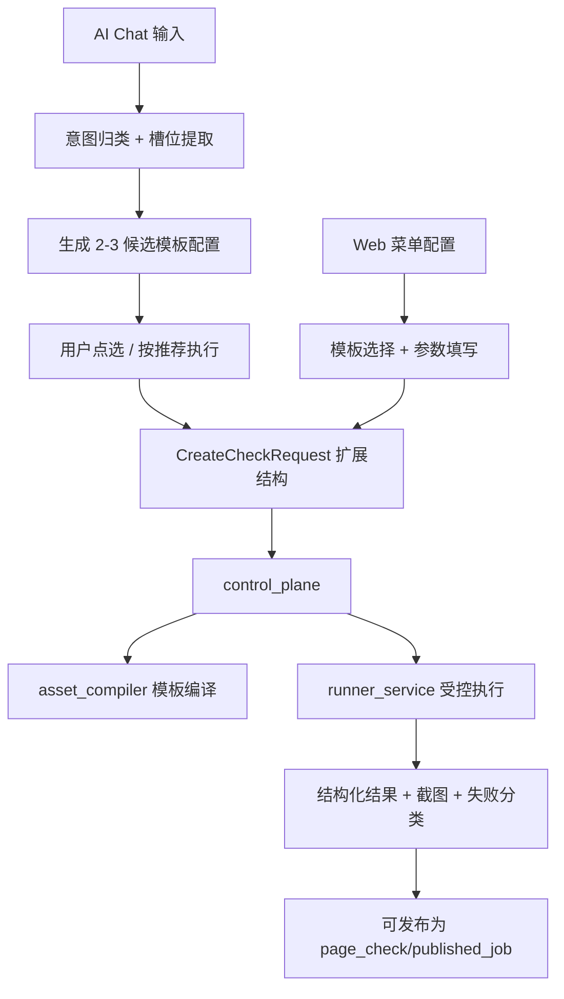

# AI Chat 模板化数据断言与企业 Web 仿真测试设计

**日期：** 2026-04-04  
**作者：** Codex  
**状态：** Draft

---

## 1. 背景与问题

当前平台已具备：

- 用户自然语言 -> `skills` 提取结构化参数
- `control_plane` 统一受理执行
- `asset_compiler` 产出 `page_check/module_plan`
- `runner_service` 执行菜单到页与基础断言

但对企业管理平台最核心的“页面内数据状态判定”能力仍不足，典型缺口：

- “用户管理页搜索用户名=xxx是否返回数据”
- “某页面当前是否有数据”
- “某状态（如待审批）是否存在”

根因不是单点缺陷，而是当前能力主要覆盖“导航与静态断言”，缺少“参数化数据断言模板 + 受控运行模块”闭环。

---

## 2. 设计目标与边界

### 2.1 目标

1. 为 AI Chat 与 Web 配置入口提供统一的数据断言能力。
2. 第一阶段覆盖 Vue/React 企业 Web 管理平台高频场景，目标覆盖率 80%。
3. 保持资产主模型与受控执行边界，不退化为自由脚本平台。

### 2.2 非目标

1. 不在后端直接解析自然语言。
2. 不让自由 Playwright 脚本文本成为执行真相。
3. 不在 V1 引入完整 DSL 与无限制运行时推理。

### 2.3 V1 安全边界

- **仅允许只读检查**：不执行可能修改资源/数据状态的操作。
- 正式执行必须继续由服务端认证注入。
- 页面命中但模板关键元素缺失时直接失败（`element_asset_missing`）。

---

## 3. 方案对比与结论

### 3.1 方案 A：模板优先（推荐）

通过固定模板族覆盖高频场景，参数化执行但不放开自由推理。

优点：

- 与现有 `asset-first + control_plane + runner_service` 架构一致
- 结果可审计、可复现、可调度
- 最适合企业内治理与权限边界

缺点：

- 长尾场景扩展速度低于 DSL

### 3.2 方案 B：模板 + 通用过滤器

在模板基础上增加更强抽象（字段/操作符/值）。

优点：通用性更高。  
缺点：V1 复杂度与误判风险上升。

### 3.3 方案 C：运行时自由推理

优点：表面灵活。  
缺点：不可控、不可审计，不符合平台定位。

### 3.4 结论

V1 采用方案 A，并在内核上预留模板扩展能力，后续按数据再演进到受限 DSL 子集。

---

## 4. 总体架构：双入口、同一执行内核

关键原则：

- Chat 与 Web 只是不同入口，正式执行模型唯一。
- 执行真相保持 `page_check + module_plan + runtime_policy`。
- 调度对象保持资产化对象，不直接调度孤立脚本文本。

---

## 5. 模板内核设计（可扩展）

### 5.1 模板注册中心

新增模板定义契约：

- `template_code`
- `template_version`
- `supported_carriers`（V1: `table/list`）
- `required_slots`
- `assertion_contract`
- `compile_strategy`

### 5.2 V1 模板族

- `has_data`：存在数据
- `no_data`：无数据
- `field_equals_exists`：字段等值命中存在
- `status_exists`：状态存在
- `count_gte`：数量阈值断言

### 5.3 扩展机制

- 新增模板通过“注册 + 编译映射 + 测试”接入，不改主流程。
- 支持 `template_version` 并存，已发布任务绑定版本，避免升级回归。
- 先做能力探测，不满足执行前置条件时直接返回不可执行原因。

---

## 6. AI Chat 交互设计（已确认口径）

1. Chat 先归类模板意图与槽位。
2. 默认返回 `2-3` 个可点击候选配置。
3. 候选排序规则：**历史命中成功率优先**。
4. 用户可点选执行，也可直接“按推荐执行”（自动选择第 1 候选）。
5. 槽位不全时优先候选化，仍不足则单问题追问关键缺失参数。

---

## 7. 后端职责与数据流

### 7.1 Control Plane

- 扩展请求结构：`template_code/template_version/template_params/carrier_hint`
- 承担参数校验、轨道选择、错误边界输出
- 保持 `precompiled/realtime_probe` 双轨语义

### 7.2 Asset Compiler

- 根据模板与参数编译确定性 `module_plan`
- `page_check` 绑定模板元数据、输入契约、断言契约

### 7.3 Runner Service

补齐模板通用模块（示例）：

- `action.apply_filter`
- `action.submit_query`
- `assert.data_count`
- `assert.row_exists_by_field`

输出结构化结果：

- 断言结论
- 命中数量/关键样本摘要
- `final_url/page_title`
- 截图 artifacts
- 失败分类

---

## 8. 第一阶段覆盖范围（企业管理平台导向）

目标系统：内部数据库管理平台、云资源管理平台等 Vue/React 管理后台。

V1 覆盖重点（只读）：

1. 资源列表有无数据（table/list）
2. 条件查询命中（名称/ID/状态）
3. 状态筛选与标签存在
4. 详情页可达与关键字段存在
5. 分页/排序后数据断言保持成立
6. 常见异常态识别（无权限/配额不足/业务错误提示）

V1 暂不覆盖：

- 破坏性写操作（创建/删除/修改）
- 复杂上传与富文本复杂交互
- 无边界跨页面多步骤业务编排

---

## 9. 覆盖率验收口径（双指标）

第一阶段“80% 覆盖率”定义为以下两项同时达标：

1. **场景清单覆盖率**：高频场景基线清单中，模板可覆盖项 >= 80%
2. **真实请求成功覆盖率**：当前线上/准生产执行请求中，命中模板并成功执行占比 >= 80%

说明：当前阶段不强制固定时间窗口，优先基于“当前样本”持续观测；后续再固化 7/30 天统计口径。

---

## 10. 反过度设计护栏

1. V1 不上完整 DSL，不做自由运行时脚本推理。
2. V1 只交付高频只读模板闭环，不追求一次性覆盖全部长尾。
3. 禁止在 `runner_service` 注入业务领域判断，保持模块通用化。
4. 禁止自动发布/自动改模板，所有治理动作保持可审计与显式触发。

---

## 11. 风险与缓解

1. 模板命中不足：通过模板命中与失败分类指标回流迭代模板目录。
2. 跨框架差异：以 `table/list` 承载抽象 + locator bundle 分层适配。
3. 误判成本：先只读、先解释性结果、先截图证据，降低错误影响。

---

## 12. 后续实施建议

1. 先落地 V1 最小模板闭环（`has_data/field_equals_exists` + table/list）。
2. 打通 Chat 候选推荐链路与成功率排序数据源。
3. 建立模板扩展准入标准（新增模板必须附带编译测试、运行测试、回归测试）。
4. 在稳定运行后评估受限 DSL 子集（非 V1 必选）。

