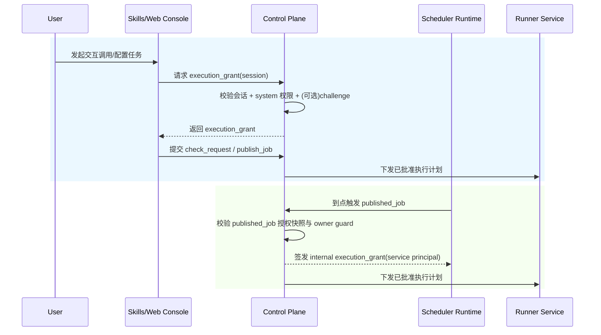

# Skills 调用认证与授权治理设计

**日期：** 2026-04-04  
**作者：** Codex  
**状态：** Draft

---

## 1. 文档定位

本文档定义 Runlet 平台在 `skills/web console/scheduler -> control_plane -> runner_service` 调用链上的认证与授权治理方案，解决以下核心问题：

- 不能允许任意人通过 `skills` 调用任意系统
- 认证与授权必须统一由后端控制面收敛，不在 `skills` 层分散实现
- 正式执行仍保持“服务端认证注入 + 资产主模型 + 受控执行”主链
- 支持会话登录、系统级授权、短期执行凭证、高风险动作闸门与调度委托执行

本设计只讨论后端治理边界与调用契约，不涉及前端 UI 细节实现。

---

## 2. 设计目标与非目标

### 2.1 目标

1. 建立“人用户登录态”和“执行态授权”分离模型
2. 支持用户级别的 `system` 访问控制（第一版最小颗粒度）
3. 引入短期执行授权凭证，避免会话 token 直接进入执行入口
4. 对部分高风险动作增加二次确认闸门
5. 建立调度执行的服务主体授权模型，覆盖“人配置、机器触发”场景
6. 建立完整审计链路，记录认证、授权、执行授权决策与拒绝原因

### 2.2 非目标

1. 第一版不引入 OIDC/SSO 外部身份源
2. 第一版不做 `page_check` 级细粒度权限
3. 第一版不引入完整策略引擎（OPA/Casbin）
4. 不把本地浏览器登录态复用为正式执行主链
5. 不让 `skills` 直接持有系统凭据或直接调用 runner

---

## 3. 方案比较与推荐

### 3.1 方案 A：会话直连执行

做法：

- 用户登录后携带会话直接调用执行 API
- 后端直接以会话判权

优点：

- 实现最简单

缺点：

- 会话权限边界宽，执行接口暴露面较大
- 防重放、最小授权和审计追踪能力弱

### 3.2 方案 B：会话 + 短期执行授权（推荐）

做法：

- 用户先登录获得会话
- 调用前由 `control_plane` 签发短期 `execution_grant`
- 执行入口仅接受 `execution_grant`

优点：

- 最小授权和短时有效边界清晰
- 防重放能力强
- 审计可精确追溯到“人-系统-动作-请求”

缺点：

- 比方案 A 多一层授权签发与校验逻辑

### 3.3 方案 C：会话 + 外置策略引擎

做法：

- 会话认证后由策略引擎做动态 ABAC 判权

优点：

- 长期灵活性最高

缺点：

- 第一版复杂度过高
- 需要额外运维、规则治理和调试成本

### 3.4 推荐结论

第一版采用 **方案 B（会话 + 短期执行授权）**，并预留策略扩展点，为后续演进到外置策略引擎保留接口。

---

## 4. 架构边界与职责

### 4.1 总体边界

1. `skills`：只负责自然语言编排与结构化参数构造
2. `control_plane`：唯一跨域编排者，负责认证、授权、签发执行授权、投递执行任务
3. `auth_service`：仅负责目标系统认证注入，不负责平台用户身份认证
4. `runner_service`：仅执行已批准计划，不接收裸会话 token
5. `scheduler_runtime`：仅以服务主体触发已发布对象，不继承用户会话

### 4.2 核心约束

1. 正式执行必须由服务端注入认证
2. 不输出完整 `storage_state` 到上层调用方
3. 调度主对象保持 `page_check / asset_version / runtime_policy`
4. `script_renders` 继续是派生产物，不成为执行真相

---

## 5. 认证授权流程

### 5.1 标准流程（低风险动作）

1. 用户登录平台，获得 `session`（短期）
2. `skills` 请求 `control_plane` 签发 `execution_grant`
3. 控制面校验：
   - session 有效
   - 用户对目标 `system` 有权限
   - action 在角色允许范围内
4. 校验通过后签发短期 `execution_grant`（绑定 user/system/action/request）
5. 执行接口使用 `execution_grant` 调用，runner 校验后执行

### 5.2 高风险动作流程

高风险动作（第一版）：

- `publish_job`
- `update_auth_policy`
- `trigger_full_crawl`
- `manage_system_credentials`

流程差异：

1. 在签发 `execution_grant` 前进入 `pending_challenge`
2. 用户完成二次确认（第一版可采用“登录密码再验证”）
3. 通过后签发 grant；未通过返回拒绝并记录审计

### 5.3 Web 管理平台任务配置与调度触发流程

本平台存在两类入口：

1. 交互入口：`skills` 或 Web 管理平台手动触发
2. 调度入口：`scheduler_runtime` 到点触发 `published_job`

统一规则：

1. 配置阶段（创建/更新 `published_job`）始终按“人用户会话 + system 权限 + 高风险闸门”判权
2. 触发阶段（cron 到点）不复用用户会话，改为服务主体授权
3. 调度触发时由 `control_plane` 依据 `published_job` 绑定的授权快照签发内部 grant
4. 若策略启用 `strict_owner_guard=true`，当创建者权限失效时自动暂停 `published_job`

### 5.4 统一时序图（交互调用 vs 调度调用）

---

## 6. 数据模型设计（新增）

### 6.1 用户与会话

`users`

- `id`
- `username`（唯一）
- `password_hash`
- `status`（active/disabled）
- `created_at`
- `updated_at`

`user_sessions`

- `id`
- `user_id`
- `session_token_hash`
- `issued_at`
- `expires_at`
- `revoked_at`
- `client_fingerprint`

### 6.2 系统级授权

`user_system_permissions`

- `id`
- `user_id`
- `system_id`
- `role`（viewer/operator/admin）
- `effect`（allow）
- `expires_at`
- `created_by`
- `created_at`

### 6.3 执行授权凭证

`execution_grants`

- `id`
- `grant_jti`（唯一）
- `user_id`
- `system_id`
- `action`
- `request_id`
- `issued_at`
- `expires_at`
- `used_at`
- `status`（active/used/revoked/expired）
- `challenge_id`（可空，高风险动作必填）
- `subject_type`（human/service）
- `subject_id`（user_id 或 service_principal_id）

### 6.4 审计日志

`auth_audit_logs`

- `id`
- `user_id`
- `system_id`
- `action`
- `decision`（allow/deny/challenge_required/challenge_failed）
- `reason`
- `request_id`
- `ip`
- `user_agent`
- `channel`（skill/web_console/scheduler）
- `subject_type`（human/service）
- `delegated_from_user_id`（可空，调度触发时记录任务创建者）
- `created_at`

### 6.5 调度服务主体与委托快照

`service_principals`

- `id`
- `code`（如 `scheduler_runtime`）
- `status`（active/disabled）
- `allowed_actions`
- `created_at`

`published_jobs`（补充字段）

- `created_by_user_id`
- `authorization_snapshot`（创建时的 system/action/role 快照）
- `strict_owner_guard`（默认 true）

---

## 7. 与现有执行模型的衔接

### 7.1 现有模型保持不变

1. `execution_requests`：继续记录结构化请求
2. `execution_plans.auth_policy`：继续使用 `server_injected`
3. `auth_states.token_fingerprint`：继续追踪目标系统认证态，不与用户会话混用
4. `published_jobs`：新增授权快照字段，显式绑定“谁创建、谁授权、以何规则调度”

### 7.2 新增字段建议

为增强可追溯性，建议在 `execution_requests` 增加：

- `requested_by_user_id`（可空，兼容非用户来源）
- `request_source_detail`（如 `skill:<name>`）
- `channel`（skill/web_console/scheduler）
- `delegated_from_published_job_id`（可空，调度触发场景）

---

## 8. API 契约建议（第一版）

### 8.1 平台身份认证

1. `POST /api/v1/platform-auth/login`
2. `POST /api/v1/platform-auth/logout`
3. `GET /api/v1/platform-auth/me`

### 8.2 二次确认

1. `POST /api/v1/platform-auth/challenges`
2. `POST /api/v1/platform-auth/challenges/{challenge_id}:verify`

### 8.3 执行授权

1. `POST /api/v1/execution-grants`
2. `POST /api/v1/check-requests`（要求 `execution_grant`）
3. 其他高风险执行入口同样要求 `execution_grant`

### 8.4 调度授权接口（内部）

1. `POST /api/v1/internal/published-jobs/{job_id}:issue-grant`
2. 仅 `scheduler_runtime` 服务主体可调用
3. 返回 `subject_type=service` 的内部 `execution_grant`
4. 若命中 owner guard 拒绝策略，可返回“自动暂停任务 + 拒绝触发”

说明：

- `request_source` 保留用于来源标识，不再作为安全凭证
- 任何正式执行入口不接受“仅会话、无 grant”模式

---

## 9. 安全控制细节

### 9.1 token 与会话安全

1. 会话 token 仅以 hash 落库
2. Cookie 使用 `HttpOnly + SameSite=Lax + Secure(生产)`
3. 会话默认 TTL 8 小时（可配置）
4. grant 默认 TTL 1-5 分钟（可配置）

### 9.2 防重放与最小授权

1. grant 绑定 `grant_jti` 唯一值
2. grant 绑定 `system_id + action + request_id`
3. grant 使用后写 `used_at`，重复使用返回冲突
4. grant 过期、撤销、scope 不匹配均拒绝
5. 内部 grant 与外部 grant 使用同一校验器，避免双轨安全分叉

### 9.3 敏感信息处理

1. 禁止日志记录明文 token/密码/storage_state
2. API 对外错误信息最小化
3. 详细拒绝原因只进入审计日志

---

## 10. 错误语义

1. `401`：未认证或会话过期
2. `403`：无系统权限或动作未授权
3. `428`：需要二次确认但未完成
4. `409`：grant 已使用（重放）
5. `422`：grant 与请求 scope 不匹配
6. `423`：调度触发被 owner guard 锁定（创建者权限失效）

---

## 11. 测试与验收

### 11.1 必测用例

1. 登录成功/失败与会话过期
2. `system` 级权限命中与拒绝
3. grant 签发、过期、撤销、重放
4. 高风险动作 challenge 闸门
5. 无 grant 调执行接口必须拒绝
6. 审计日志在 allow/deny/challenge 场景均落库
7. Web 配置任务后，调度触发可走 service principal 授权链
8. 创建者权限撤销后（strict guard），调度任务自动暂停并拒绝触发

### 11.2 验收标准

1. 任意未授权用户无法通过 `skills` 调用未授权系统
2. 任意正式执行均可追溯到具体用户与授权决策
3. 高风险动作未经二次确认无法执行
4. 不泄露平台会话、系统凭据和 storage_state
5. Web 管理平台创建的任务在调度触发时仍满足可审计和最小授权

---

## 12. 分阶段落地计划（建议）

### Phase 1：身份与系统级授权基线

- 落地 `users/user_sessions/user_system_permissions`
- 管理端支持用户与系统授权配置

### Phase 2：execution_grant 与执行入口强校验

- 落地 `execution_grants`
- 执行入口统一改造为“仅认 grant”

### Phase 2.5：调度服务主体与委托授权

- 落地 `service_principals`
- 为 `published_jobs` 增加授权快照与 owner guard
- 调度触发改为内部 grant 签发与统一校验

### Phase 3：高风险动作二次确认

- 落地 challenge 模型与校验链路
- 高风险动作接入闸门

### Phase 4：审计与风控增强

- 审计检索页与异常告警规则
- 补充报表与安全运营视图

---

## 13. 风险与后续演进

### 13.1 已知风险

1. 第一版仅 system 级授权，仍可能过粗
2. 内置账号体系在多团队协作下管理成本上升
3. challenge 机制若体验设计不当，会增加操作摩擦

### 13.2 后续演进方向

1. 扩展到 `system + action + page_check` 分层授权
2. 对接 OIDC/SSO
3. 引入外置策略引擎（ABAC）与审批流

---

## 14. 结论

本方案以“会话认证 + 短期执行授权 + 高风险二次确认”为核心，在不破坏当前架构边界的前提下，提供了可审计、可收敛、可迭代的 `skills` 调用安全治理路径。第一版先收敛系统级权限与执行授权主链，确保“谁能调用哪个系统”成为平台内可控、可追踪、可验证的正式能力。
