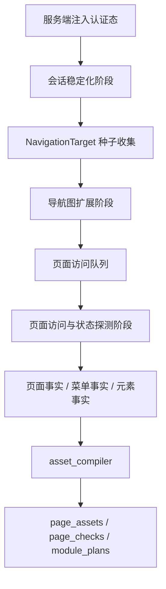

# 通用采集健壮性与采集完整性增强设计

**日期：** 2026-04-05  
**作者：** Codex  
**状态：** Draft

---

## 1. 文档定位

本文档定义当前 Runlet 平台面向通用 Web 后台系统的采集健壮性增强方案，目标是在不引入系统专属硬编码分支的前提下，提升 `crawler_service` 对登录后菜单、页面和关键元素事实的采集完整度，并优先验证该通用增强是否能够解决 `HotGo` 当前采集结果明显不完整的问题。

本文档严格遵守现有平台约束：

- 检查资产是主模型
- Playwright 脚本是派生产物
- 正式执行统一走 `control_plane`
- 认证注入必须由服务端统一处理

因此，本设计聚焦于事实层采集能力增强，而不是为某个单独系统拼接临时浏览器脚本。

---

## 2. 背景与问题归因

### 2.1 当前问题现象

当前 `system` 表中配置的 `HotGo` 采集结果明显不完整。已确认的最近一次采集结果表现为：

- 仅产出 1 个页面事实
- 未产出菜单事实
- 未产出元素事实
- 页面事实仅落到根路径 `/`
- 采集过程中出现 `state_transition_not_applied` 警告

这说明问题主要发生在 `crawler_service` 侧，而不是后续 `asset_compiler` 丢失数据。当前链路尚未稳定完成以下关键步骤：

- 登录后进入真实业务路由
- 等待应用壳与内容区稳定
- 展开折叠菜单和隐藏导航入口
- 发现并访问登录后可达页面
- 对代表状态进行受控只读探测

### 2.2 当前实现的结构性缺口

现有实现存在以下结构性问题：

1. 路由识别过度依赖 `window.location.pathname`
2. 菜单发现更接近“当前 DOM 快照”，没有显式的展开与重扫机制
3. 状态探测动作依赖已采到的元素，导致“首轮没采到元素 -> 后续没有动作”的循环依赖
4. 页面稳定判定不足，容易在登录后重定向、壳渲染、异步权限菜单尚未完成时过早采样
5. 失败信号过于粗糙，无法准确区分“路由未解析”“菜单未 materialize”“动作未生效”“内容未稳定”

### 2.3 范围判断

本次设计聚焦于通用采集机制增强，不直接进入系统专属适配。若通用增强完成后，个别系统仍存在盲区，则允许补充“可复用适配层”，但不允许写成只适配某一套 Web 系统的专属采集分支。

---

## 3. 目标、非目标与约束

### 3.1 设计目标

本次设计目标如下：

1. 优先增强通用 `crawler_service` 能力，验证是否能够解决 `HotGo` 采集不完整问题
2. 以 `菜单 / 页面 / 元素` 完整度明显提升作为本轮首要验收指标
3. 允许采集过程中执行受控、只读、非提交型动作，以提升隐藏页面和状态事实的召回率
4. 将路由解析、页面稳定化、导航展开、状态探测拆分为职责清晰的阶段
5. 形成可诊断、可测试、可迭代的事实采集主链

### 3.2 已确认约束

本轮范围约束已经确认如下：

- 优先做通用机制增强，不先做 `HotGo` 专属适配
- 若后续仍需适配，必须抽象为可复用能力
- 本轮主验收指标是 `菜单 / 页面 / 元素` 完整度明显提升
- 允许的交互深度包括：
  - 菜单展开
  - 二级菜单悬浮
  - Tabs 切换
  - 树节点展开
  - 分页前几页切换
  - 弹窗打开
  - 抽屉打开
- 不允许提交表单或执行写操作
- 代价模型偏向“单次采集可以更慢，但尽量采全”

### 3.3 非目标

本次设计明确不做以下事项：

- 不把 `crawler_service` 变成正式执行引擎
- 不为 `HotGo` 写专属硬编码采集流程
- 不引入破坏性操作、写操作或表单提交
- 不让 CLI / MCP / Skills 绕过后端正式采集链路
- 不在本轮同时建设长期前端 E2E 基础设施
- 不把网络侧候选信号直接提升为系统真相，必须经过页面可见性或访问验证

---

## 4. 方案比较与推荐

### 4.1 方案 A：继续增强现有启发式脚本

做法：

- 在现有 route hints、DOM 菜单扫描、元素抓取和状态探测脚本上持续追加更多选择器、更多等待、更多点击规则

优点：

- 改动最小
- 可以短期提升部分页面覆盖率

缺点：

- 仍然是规则堆叠
- 难以解释页面发现与状态探测的职责边界
- 对 `hash route + 折叠菜单 + 懒渲染` 型后台系统韧性不足

### 4.2 方案 B：三段式通用采集引擎

做法：

- 将采集主链拆为：
  - 会话稳定化
  - 导航图扩展
  - 页面访问与状态探测
- 引入统一的导航目标模型、阶段状态机和失败分级

优点：

- 职责清晰，便于定位问题
- 与事实层、资产层、执行层的既有主线兼容
- 能同时解决路由解析、菜单展开、隐藏入口 materialize、状态补盲等问题
- 后续即使增加适配，也能收敛为复用能力

缺点：

- 改动范围大于继续堆启发式规则
- 需要扩展事实模型和测试模型

### 4.3 方案 C：策略配置优先的采集器

做法：

- 引入 crawl profile 或系统策略配置，告诉采集器如何展开菜单、识别入口、探测状态

优点：

- 对复杂系统补盲速度快
- 便于后续运营调整

缺点：

- 若缺乏强健底座，会退化成“每接一个系统写一份采集说明书”
- 不适合作为本轮主路线

### 4.4 推荐结论

采用 **方案 B：三段式通用采集引擎** 作为本轮主方案，并为后续策略配置预留接口，但不把策略配置作为当前主能力。

推荐理由如下：

- 它直接对应当前真实问题的根因
- 能优先提升通用采集健壮性
- 与“先做通用增强，再决定是否补可复用适配层”的目标一致
- 能把 `HotGo` 当前问题转化为通用机制短板，而不是单系统例外

---

## 5. 总体架构

架构边界保持如下：

- `crawler_service` 只负责事实采集和诊断，不负责正式执行
- `asset_compiler` 继续负责把事实转换为资产
- `runner_service` 继续只消费被批准的资产与计划
- `control_plane` 继续作为跨域编排入口

---

## 6. 采集主流程重构

### 6.1 会话稳定化阶段

本阶段目标是确认浏览器上下文已经真正进入登录后的业务态，而不是仅仅完成页面跳转。

该阶段必须完成三件事：

1. 确认认证态生效
2. 确认应用壳已经挂载
3. 确认真实业务路由可解析

只有完成上述条件后，才允许进入页面发现和菜单采集阶段。

### 6.2 导航图扩展阶段

本阶段不直接输出最终页面，而是先输出可探索的导航目标集合。导航目标来源包括：

- 运行时路由对象
- 当前 DOM 中的菜单和导航节点
- `hash route`
- 页面内工作台卡片和业务入口
- 网络返回中的菜单或路由候选
- 页面中的 Tabs、弹窗、抽屉等状态入口

该阶段的职责是“找全候选”，而不是立即确认所有候选都应成为正式页面。

### 6.3 页面访问与状态探测阶段

本阶段对被确认的页面入口逐页访问，并在页面访问后派生安全的状态探测动作，补齐：

- Tabs 对应的状态事实
- 分页前几页代表状态
- 弹窗与抽屉中的只读内容
- 树和折叠区展开后的页面结构

页面发现与状态发现必须解耦，避免再次出现“没有首轮元素 -> 后续没有动作”的循环依赖。

---

## 7. 导航目标模型、状态机与预算控制

### 7.1 NavigationTarget 模型

建议在 `crawler_service` 内新增统一的 `NavigationTarget` 模型，至少包含以下字段：

- `target_kind`
- `route_hint`
- `locator_candidates`
- `state_context`
- `parent_target_key`
- `discovery_source`
- `safety_level`
- `materialization_status`

其中：

- `target_kind` 限定为：
  - `page_route`
  - `menu_expand`
  - `tab_switch`
  - `tree_expand`
  - `paginate_probe`
  - `open_modal`
  - `open_drawer`
- `materialization_status` 建议至少包含：
  - `discovered`
  - `queued`
  - `applied`
  - `not_applied`
  - `blocked`
  - `duplicate`

### 7.2 采集状态机

采集过程建议按以下阶段流转：

1. `session_ready`
2. `nav_seeded`
3. `nav_expanding`
4. `page_visiting`
5. `state_probing`
6. `snapshot_finalize`

这样可以把“会话问题”“导航问题”“页面访问问题”“状态探测问题”显式分层，便于诊断。

### 7.3 去重与预算控制

去重不能只按路由进行，应至少基于以下维度组合：

- `target_kind`
- `resolved_route`
- `state_context`
- `parent_target_key`

预算控制需要覆盖：

- 每系统总导航动作上限
- 每页状态动作上限
- 每类动作上限
- 单个父菜单的子节点展开上限

虽然本轮偏向“慢一点也尽量采全”，但仍需硬预算，避免复杂后台进入无限展开或重复点击。

### 7.4 失败分级

失败信号必须分级，而不是继续只输出单一模糊 warning。建议至少区分：

- `route_unresolved`
- `app_shell_unstable`
- `content_not_ready`
- `expand_locator_missing`
- `hover_expand_timeout`
- `child_nodes_not_materialized`
- `action_not_applied`
- `permission_blocked`
- `route_visible_but_unreachable`

---

## 8. 路由解析与页面稳定化机制

### 8.1 统一路由解析

页面与状态访问过程中，不再将 `window.location.pathname` 视为唯一真相，而是统一产出 `resolved_route`。

建议的解析优先级如下：

1. 运行时 router 当前路由
2. `location.hash` 中可提取的业务路由
3. `history.state` 或框架内部 location
4. `pathname`
5. 当前激活菜单、面包屑、Tabs 等 DOM 语义辅助信号

这样可以兼容：

- `#/dashboard`
- `/admin#/user/index`
- 登录后经由前端 runtime redirect 才落定的 SPA 路由

### 8.2 页面稳定化分层

建议将稳定化拆为三个层次：

- `shell_ready`
- `route_ready`
- `content_ready`

定义如下：

- `shell_ready`：应用主壳、导航骨架、主内容容器可见
- `route_ready`：`resolved_route` 已切换到业务态，且连续采样一致
- `content_ready`：主内容区已脱离 skeleton/loading，并出现表格、表单、标题、tab 等业务语义节点

只有满足 `route_ready + content_ready` 才允许正式沉淀页面事实。

### 8.3 登录后收敛窗口

登录成功后不应立即开始采集。建议新增短暂的“登录后收敛窗口”：

- 轮询 router、URL、hash、菜单容器和主内容区状态
- 连续多次采样比较是否仍在变化
- 若仍在变化，则继续等待直到稳定或超时
- 若超时，则明确记录失败归因

### 8.4 页面上下文元数据

为便于诊断，建议页面事实或采集中间态额外记录以下元数据：

- `route_source`
- `hash_route`
- `router_route`
- `shell_ready`
- `content_ready`
- `stabilization_attempts`

这些信息用于采集诊断，而不是作为上层业务真相直接消费。

---

## 9. 菜单展开、隐藏入口 materialize 与事实采集策略

### 9.1 菜单骨架发现

第一轮只做菜单骨架和导航容器识别，目标包括：

- 左侧导航
- 顶部导航
- 二级悬浮菜单
- 折叠面板
- 树菜单
- 面包屑
- 工作台卡片入口
- Tabs 形式的页面入口

第一轮产出的是导航目标种子，而不是最终菜单树。

### 9.2 菜单展开策略

对 `menu_expand` 类目标执行受控 materialize：

- 优先点击 `aria-expanded=false`、submenu 标题、树节点展开器
- 支持 `hover` 触发的二级菜单
- 每次展开后只重扫受影响容器
- 用展开前后 DOM 差分和容器上下文推导父子关系

### 9.3 隐藏页面入口 materialize

以下来源均可产生新的页面候选：

- 展开后出现的子菜单项
- 页面中的工作台卡片
- 具备页面级语义的 tab 子视图
- 弹窗、抽屉中的只读详情入口
- runtime router 或网络菜单接口中的候选路径

但只有满足以下条件之一，才能沉淀为正式页面事实：

- 在 UI 中被验证可见
- 被真实访问并通过稳定化验证

### 9.4 页面访问策略

对每个 `page_route`，建议执行固定访问序列：

1. 进入目标页面
2. 等待 `route_ready + content_ready`
3. 抓页面标题、breadcrumb、激活菜单和主内容结构
4. 抓当前可见元素
5. 识别该页下的状态入口
6. 执行允许的状态探测动作
7. 回收新增元素和新增页面入口

### 9.5 元素采集策略

元素采集分为三层：

1. 页面结构语义
2. 页面操作语义
3. 定位证据

采集时需记录元素是如何 materialize 出来的，例如：

- 基线页面可见
- 菜单展开后可见
- tab 切换后可见
- modal 打开后可见
- drawer 打开后可见

这类信息应进入元素级上下文，服务于后续 `state_signature` 与 `locator bundle` 编译。

---

## 10. 数据模型与持久化影响

### 10.1 事实层变化方向

建议扩展或规范以下事实信息：

- 页面层记录 `resolved_route` 及诊断性上下文
- 元素层强化 `state_context`、`state_signature`、`locator_candidates`
- 菜单层与页面层之间保留更清晰的来源和父子关系

### 10.2 中间态与正式事实的边界

`NavigationTarget`、稳定化诊断结果和失败分级首先属于采集中间态，不应直接暴露为上层业务主真相。

正式入库事实仍然以：

- `pages`
- `menu_nodes`
- `page_elements`

为主，但可适当补充能够解释采集来源与 materialize 方式的结构化字段。

### 10.3 与 asset_compiler 的关系

`asset_compiler` 不需要承担页面发现职责，但需要消费更完整的：

- 页面事实
- 菜单事实
- 状态化元素事实
- 多候选定位证据

这样后续才能更稳定地产出：

- `page_assets`
- `page_checks`
- `module_plans`

---

## 11. 验收口径

### 11.1 主验收指标

本轮首要验收指标为：**菜单、页面、元素完整度明显提升**。

### 11.2 验收维度

建议采用以下四组指标：

1. 事实数量指标
   - 同一系统新快照相对旧快照的 `menu_nodes / pages / page_elements` 增量
2. 结构覆盖指标
   - 是否出现多级菜单
   - 是否出现非根页面路由
   - 是否出现带状态上下文的元素
3. 稳定性指标
   - 同一系统连续两次 crawl，主要页面集合与事实数量不应大幅抖动
4. 诊断质量指标
   - 失败时是否能落到明确分级，而不是模糊 warning

### 11.3 HotGo 作为验证样本的最低预期

对 `HotGo`，本轮不应再接受以下结果：

- 页面只有 `/`
- 菜单数为 `0`
- 元素数为 `0`
- 所有失败都折叠为单一 `state_transition_not_applied`

`HotGo` 是本轮验证样本，但不是专属逻辑来源。

为避免后续回归把该问题重新放回“只有根页面”的旧状态，本轮还需要固定一条 `HotGo-like` 组件级样本，最少覆盖以下组合时序：

- 登录后首屏通过 `hash route` 进入真实业务页，而不是停留在 `/`
- 应用壳先稳定，菜单与内容区在后续窗口内懒加载完成
- 一级菜单展开后才 materialize 出二级菜单入口

该样本的最低回归门槛为：

- `pages_saved >= 3`
- `menus_saved >= 2`
- `elements_saved >= 2`
- 页面事实不再退化为仅有根路径 `/`

---

## 12. 测试策略

### 12.1 单元测试

至少覆盖以下能力：

- `resolved_route` 解析
- 稳定化判定
- `NavigationTarget` 去重
- 预算控制
- 失败分级

### 12.2 组件级集成测试

建议扩展 fake browser session，覆盖真实时序场景：

- `hash route` 系统
- 一级菜单展开后 materialize 子菜单
- hover submenu 才出现二级入口
- tab 切换后产生新的表格或表单
- modal / drawer 打开后产生新的元素
- 登录后壳先渲染、内容后渲染

测试不能只覆盖理想 happy path。

其中应至少保留一条 `HotGo-like` 回归样本，固定“`hash route + 懒菜单加载 + materialize 子菜单`”组合，以验证在真实 HotGo 类后台中不会再次退化为“只有根页面、无菜单、无元素”。

### 12.3 真实联调验证

继续使用 `HotGo` 作为真实验收样本，验证：

- 登录后是否解析到真实业务路由
- 菜单和页面事实是否显著增加
- 元素和状态事实是否开始稳定出现

---

## 13. 最小落地范围与后续阶段

### 13.1 M1：本轮必须落地

本轮必须交付以下能力：

- 统一 `resolved_route`
- `session_ready / route_ready / content_ready` 稳定化机制
- `NavigationTarget` 与状态机
- 菜单展开支持 `click + hover + tree expand`
- 页面访问后派生 `tab / paginate / modal / drawer` 状态探测
- 事实层保留 `state_context / locator_candidates / materialized_by`
- 失败信号从单一 warning 扩展为可诊断分类

### 13.2 M2：后续增强

本轮不强制交付，但应预留接口：

- 更高召回的菜单 / 权限接口解析
- 更细粒度的弹窗与抽屉内容分类
- 工作台卡片和复杂入口识别
- 可复用的 crawl profile 配置层
- 采集 telemetry 反哺 `asset_compiler`

---

## 14. 风险与权衡

### 14.1 复杂度提升

引入 `NavigationTarget`、稳定化判定和状态机后，`crawler_service` 内部复杂度会上升，需要通过更清晰的模块拆分和测试覆盖维持可维护性。

### 14.2 采集时长上升

由于本轮优先完整度，单次 crawl 时间会增加。这是已接受的权衡，但仍需硬预算保护，防止无限探索。

### 14.3 部分系统仍需补充适配

即便完成通用增强，仍可能遇到个别系统拥有特殊导航壳、定制组件或反常时序。若出现此类情况，应补充为可复用能力层，而不是系统专属逻辑分支。

---

## 15. 推荐结论

本轮应按以下顺序推进：

1. 先实现通用采集主链增强
2. 用 `HotGo` 进行真实验证
3. 若通用增强后仍有盲区，再补充可复用适配层

推荐原则如下：

- 优先 deterministic 实现
- 优先清晰边界
- 优先事实层主链增强
- 不以系统专属脚本替代通用机制建设

该方案能够在不偏离平台核心架构的前提下，优先解决当前采集链路“登录后菜单与页面事实采不全”的主问题，并为后续资产编译与正式执行提供更完整、可诊断的事实基础。
