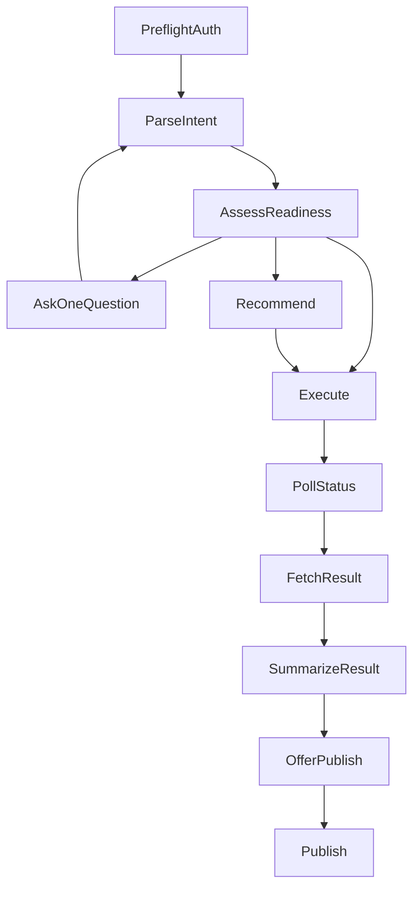

# AI Chat 检查编排 Skill 设计

**日期：** 2026-04-06  
**作者：** Codex  
**状态：** Draft

---

## 1. 文档定位

本文档定义一个面向 `AI Chat -> Skills -> control_plane -> runner_service` 主链的“检查编排 skill”设计，用于覆盖以下对话流程：

- 从自然语言中提取检查意图与槽位
- 判断当前是否满足候选查询或正式执行条件
- 在缺参时执行单问题补问
- 在高置信命中时按推荐直执行
- 调用后端检查相关 API
- 将后端结构化结果格式化为用户可消费的结论与证据摘要
- 在本次执行成功后，可选询问是否发布为调度任务

本文档只定义 skill 侧的对话编排与 API 调用规则，不改变当前正式执行真相与后端分层边界。

---

## 2. 背景与问题

当前项目已经具备以下基础能力：

- `control_plane` 统一受理 `check_request`
- 默认运行时从 `intent_aliases -> page_assets -> page_checks` 命中
- `asset_compiler` 负责把事实层编译为资产与 `module_plan`
- `runner_service` 负责按批准后的计划执行
- `skills` 渠道已支持使用 PAT 调用 `/api/v1/check-requests`
- 模板化只读数据断言 V1 已具备后端闭环

但 skill 侧仍缺少一套统一、稳定、可维护的“检查对话编排”设计。当前风险主要体现在：

1. 普通页面检查与模板化检查容易被写成两套分裂逻辑。
2. 缺参补问、候选推荐和直执行之间若没有明确门控，容易反复抖动。
3. 若 skill 把未完成的后端鉴权空洞当成正式契约，会导致后续 API 收口时行为回归。
4. 若把发布调度放进主流程，会稀释“先完成一次检查”的主任务目标。

需要一份明确设计，保证该 skill 在不破坏现有资产优先架构的前提下，成为一个可复用的“检查型对话编排层”。

---

## 3. 设计目标与非目标

### 3.1 目标

1. 统一覆盖普通页面检查与模板化只读检查两类对话入口。
2. 让 skill 明确承担“自然语言 -> 结构化请求草案 -> 候选/补问/执行”的职责。
3. 采用“推荐直执行”为默认交互模式，但必须有显式高置信门控。
4. 把 PAT 环境变量校验纳入 skill 的强前置条件。
5. 将“发布”为成功后的可选后置动作，而不是默认主流程。
6. 把后端结构化结果统一转为简洁、稳定的用户可读输出。

### 3.2 非目标

1. 不让 skill 处理服务端认证注入。
2. 不让 skill 直接生成或执行 Playwright 脚本作为主链真相。
3. 不在 V1 默认接入 `realtime_probe` 回退。
4. 不让 skill 重算后端候选排序逻辑。
5. 不把 skill 演进为自由浏览器 Agent 或自由执行器。

---

## 4. 约束与前提

### 4.1 架构边界

必须保持以下边界不变：

- `skills` 只做对话编排与受控 API 调用
- `control_plane` 负责正式受理与执行轨道选择
- `asset_compiler` 负责资产与模块计划编译
- `runner_service` 负责执行
- 正式认证注入仍由服务端统一处理

### 4.2 当前认证前提

当前代码已落地：

- Web 管理平台使用 session/cookie 创建 PAT
- Skills 渠道通过 `Authorization: Bearer <PAT>` 访问 `/api/v1`
- `POST /api/v1/check-requests` 已接入 `PrincipalDep + channel-action` 鉴权

同时需要注意当前实现差异：

- `check-requests` 相关的部分读接口与候选接口尚未像创建接口那样完全挂载同一鉴权依赖

因此，skill 设计必须采用更严格口径：

1. 所有对 `/api/v1/check-requests*` 的调用都统一携带 PAT。
2. skill 不依赖“当前某个接口恰好未强制鉴权”这一实现细节。

### 4.3 本地环境前提

skill 必须要求以下本地环境变量：

- `RUNLET_PAT`：必填
- `RUNLET_BASE_URL`：可选，默认指向本地或约定服务地址

若 `RUNLET_PAT` 缺失，skill 必须立即停止并提示用户先到 Web 管理台创建 PAT。

---

## 5. 方案比较与推荐

### 5.1 方案 A：单文件大 Prompt Skill

把槽位提取、补问、候选、执行、结果格式化、发布补问全部写进一个 `SKILL.md`。

优点：

- 上手快
- 文件集中

缺点：

- 状态分支容易混乱
- 难以维护模板与普通检查的共享逻辑
- 不利于后续针对单一规则做演进

### 5.2 方案 B：状态机式编排 Skill + 引用契约（推荐）

主 `SKILL.md` 只定义流程、状态、门控和输出规范，模板槽位、API 契约、结果格式等拆到 `references/`。

优点：

- 与当前架构分层一致
- 普通检查与模板检查可共享统一抽象
- 更适合后续扩展模板和调整门控规则

缺点：

- 初版需要更严格的设计约束

### 5.3 方案 C：把更多对话决策下沉到后端

skill 只抽最小参数，后端负责决定更多补问与推荐逻辑。

优点：

- skill 更薄

缺点：

- 破坏“自然语言解释在 skill 层”的职责边界
- 使后端承担不应承担的对话编排职责

### 5.4 结论

采用方案 B。该方案最符合当前项目“资产优先 + control plane 统一受理 + runner_service 正式执行”的主线，也最适合将该能力沉淀为一个长期可维护的 skill。

---

## 6. Skill 定位与职责边界

该 skill 的定位是：

**检查型对话编排 skill**

其职责是：

1. 从用户自然语言中抽取检查意图与槽位。
2. 形成统一的检查请求草案。
3. 判断当前应补问、展示候选还是直接执行。
4. 调用后端检查相关 API。
5. 将后端结果转为用户可读输出。
6. 在执行成功后，可选询问是否发布。

其不应负责：

1. 不直接决定正式执行细节。
2. 不处理认证注入。
3. 不绕过 `control_plane`。
4. 不直接把脚本文本作为正式执行真相。
5. 不默认触发 `realtime_probe`。

---

## 7. 总体流程与状态机

建议该 skill 使用显式七态状态机，而不是自由发挥式对话。



### 7.1 `PreflightAuth`

启动时先检查：

- `RUNLET_PAT`
- `RUNLET_BASE_URL`

若 PAT 缺失，立即终止并提示用户先在 Web 管理台创建 PAT。

### 7.2 `ParseIntent`

从用户输入中抽取：

- `system_hint`
- `page_hint`
- `check_mode`
- `check_goal`
- `template_code`
- `template_version`
- `carrier_hint`
- `template_params`

### 7.3 `AssessReadiness`

判断当前进入哪一分支：

- 信息不足：`AskOneQuestion`
- 信息足够但存在多候选：`Recommend`
- 满足高置信门槛：`Execute`

### 7.4 `AskOneQuestion`

单轮只补一个最关键字段，不允许一轮追问多个问题。

### 7.5 `Recommend`

展示 2-3 个候选，并给出简洁推荐原因。用户确认后进入执行。

### 7.6 `Execute`

调用 `/api/v1/check-requests` 提交正式检查请求。

### 7.7 `PollStatus` / `FetchResult`

轮询状态，必要时查询最终结果对象。

### 7.8 `SummarizeResult`

把结构化结果转成用户可读结论、证据与后续建议。

### 7.9 `OfferPublish`

仅在本次执行成功后询问是否发布。不成功时不进入发布流程。

---

## 8. 统一输入模型

普通检查与模板检查必须共享同一个请求草案模型，避免 skill 内部裂变为两套平行流程。

建议主抽象为 `CheckDraft`：

- `system_hint`
- `page_hint`
- `check_mode`
  - `generic_check`
  - `template_check`
- `check_goal`
- `strictness`
- `time_budget_ms`
- `request_source`
- `template_code`
- `template_version`
- `carrier_hint`
- `template_params`
- `publish_candidate`

其中：

- `request_source` 固定为 `skill`
- `strictness` 默认 `balanced`
- `time_budget_ms` 默认 `20000`
- `publish_candidate` 默认 `false`

### 8.1 普通检查的最小必需字段

- `system_hint`
- `check_goal`

`page_hint` 可以缺省，因为当前主链允许通过 `intent_aliases -> page_assets -> page_checks` 命中。

### 8.2 模板检查的最小必需字段

除通用字段外，还要求：

- `template_code`
- `template_version`
- `carrier_hint`
- `template_params`

当前模板检查只覆盖只读模板，不允许请求超出后端 `readonly template` 守卫的范围。

---

## 9. 补问规则与优先级

补问适用于“信息缺失”，不是用于解决“存在多个合理候选”。

### 9.1 补问优先级

建议按以下顺序补问：

1. `system_hint`
2. `check_goal`
3. 模板必填槽位
4. `page_hint`

### 9.2 单问题原则

每轮只追问一个问题。这样可以：

- 避免对话退化为表单
- 保持上下文聚焦
- 降低用户一次性回答多个字段的负担

### 9.3 模板槽位来源

模板必填槽位不写死在主 `SKILL.md` 中，而由 `references/template-slots.md` 维护。

V1 至少覆盖：

- `has_data`
- `no_data`
- `field_equals_exists`
- `status_exists`
- `count_gte`

---

## 10. 候选推荐与直执行门控

### 10.1 候选查询条件

允许调用 `POST /api/v1/check-requests:candidates` 的前提：

- `system_hint` 已明确
- 意图已能归一为可查询的 `intent`
- `page_hint` 可选
- `slot_hints` 可部分缺省

若连候选查询条件都不满足，必须先补问。

### 10.2 候选推荐职责边界

候选排序逻辑由后端负责。skill 只负责：

1. 构造候选查询参数
2. 解读返回结果
3. 决定是直执行还是停下来确认

### 10.3 高置信直执行条件

建议仅在以下条件全部满足时允许直执行：

1. `system_hint` 明确
2. 当前不存在多系统歧义
3. 普通检查的 `check_goal` 足够具体，或模板必填槽位已齐
4. 候选存在稳定第一名
5. 第一名对第二名存在足够分差
6. 用户表达中没有明显不确定措辞

### 10.4 必须停止确认的场景

任一满足即转为 `Recommend`：

1. 候选为空
2. 候选不止一个且分数接近
3. `page_hint` 与候选结果不一致
4. 模板参数虽齐，但页面命中明显不稳定
5. 用户语句包含多个页面或多个动作

### 10.5 推荐展示方式

推荐时展示 2-3 个候选，并给出简洁理由，例如：

- 历史成功率更高
- 与你给出的页面词更接近
- 最近命中更多
- 更符合当前模板参数语义

不直接把原始分数表完整暴露给用户。

---

## 11. API 编排规范

### 11.1 统一调用原则

所有 `/api/v1/check-requests*` 调用都统一带：

`Authorization: Bearer ${RUNLET_PAT}`

即使当前部分接口未强制鉴权，skill 也不得省略。

### 11.2 候选查询

接口：

- `POST /api/v1/check-requests:candidates`

用途：

- 当可形成候选查询但尚不满足直执行条件时使用

### 11.3 正式执行

接口：

- `POST /api/v1/check-requests`

普通检查请求体至少包含：

- `system_hint`
- `page_hint`
- `check_goal`
- `strictness`
- `time_budget_ms`
- `request_source=skill`

模板检查在此基础上追加：

- `template_code`
- `template_version`
- `carrier_hint`
- `template_params`

### 11.4 状态轮询

接口：

- `GET /api/v1/check-requests/{request_id}`

建议 skill 使用有限轮询，不允许无限等待。若超过本地等待上限，应向用户返回“已受理，可稍后继续查询”。

### 11.5 结果查询

接口：

- `GET /api/v1/check-requests/{request_id}/result`

关注字段：

- `execution_track`
- `execution_summary`
- `artifacts`
- `needs_recrawl`
- `needs_recompile`

### 11.6 可选发布

接口：

- `POST /api/v1/check-requests/{request_id}:publish`

该流程只在执行成功且用户明确同意发布后触发。

---

## 12. 结果格式化规范

skill 不应直接返回原始 JSON，应统一格式化为四段语义：

### 12.1 结论

- 成功
- 失败
- 已受理但仍在运行

### 12.2 定位

摘要说明：

- 命中的系统
- 页面或检查对象
- 执行轨道

### 12.3 证据

优先展示少量高价值字段：

- `final_url`
- `page_title`
- `duration_ms`
- `failure_category`

若存在截图或关键模块产物，可补充 1-2 条摘要，不展开整份工件 JSON。

### 12.4 后续动作

- `needs_recrawl=true`：建议补采集
- `needs_recompile=true`：建议补编译
- 执行成功：可额外询问是否发布为定时任务

---

## 13. 为什么 V1 不默认接入 `realtime_probe`

本设计明确不把 `realtime_probe` 作为默认 skill 流程的一部分，原因如下：

1. 该 skill 的定位是稳定的检查编排，而不是临场探测 Agent。
2. 自动进入 `realtime_probe` 会提高解释成本与用户感知风险。
3. 当前项目主线仍是资产优先与 `control_plane` 统一正式执行。
4. 若未来需要支持，也应作为单独能力门控，而不是当前 skill 的默认退路。

---

## 14. Skill 目录结构建议

建议目录结构如下：

```text
<skill-name>/
├── SKILL.md
├── references/
│   ├── api-contract.md
│   ├── decision-rules.md
│   ├── template-slots.md
│   ├── result-format.md
│   └── setup-and-auth.md
└── agents/
    └── openai.yaml
```

### 14.1 `SKILL.md`

只保留：

- 触发条件
- 非目标
- 七态状态机
- 补问原则
- 推荐直执行门控
- PAT 前置检查
- 完成与退出条件

### 14.2 `references/setup-and-auth.md`

写清楚：

- 需要 `RUNLET_PAT`
- 可选 `RUNLET_BASE_URL`
- PAT 从何处创建
- PAT 缺失时如何终止

### 14.3 `references/api-contract.md`

只记录最小 API 契约，不复制完整后端文档。

### 14.4 `references/decision-rules.md`

记录：

- 何时补问
- 何时推荐
- 何时直执行
- 何时停止

### 14.5 `references/template-slots.md`

记录模板槽位定义与示例表达。

### 14.6 `references/result-format.md`

记录结果转述模板，避免把后端 JSON 直接抛给用户。

---

## 15. 最小验证场景

为了保证该 skill 可落地，建议至少用以下压力场景验证：

1. 用户只说“帮我看一下 ERP”
   - 预期：必须补问检查目标

2. 用户说“看看 ERP 用户管理页有没有 alice”
   - 预期：可归入模板检查候选；若模板槽位仍不全，继续单轮补问

3. 用户说“检查 ERP 首页菜单是否完整”
   - 预期：走普通检查，不强套模板

4. 用户说“帮我检查库存页并且以后每天跑”
   - 预期：先检查；只有成功后才询问是否发布

5. 本地未配置 `RUNLET_PAT`
   - 预期：立即终止并提示先创建 PAT

6. 候选结果存在两个分数接近页面
   - 预期：展示候选，不允许偷跑直执行

---

## 16. 实施建议

建议后续实现顺序如下：

1. 先把 skill 文档写成“流程型 skill”，不急于补脚本。
2. 优先稳定 `SKILL.md + references/decision-rules.md + references/setup-and-auth.md`。
3. 再补 `template-slots.md` 与 `api-contract.md`。
4. 若后续发现请求构造与结果轮询存在大量重复，再考虑新增 `scripts/` 做低自由度辅助。

---

## 17. 结论

该 skill 应被设计为一个统一的检查型对话编排层：

- 同时覆盖普通页面检查与模板化只读检查
- 默认推荐直执行，但受显式高置信门控约束
- 把 PAT 环境变量视为强前置条件
- 把发布调度视为成功后的可选后置动作
- 保持正式执行真相继续留在 `control_plane -> asset_compiler -> runner_service`

这样既能满足当前 AI Chat 场景中的实用需求，又不会破坏项目现有的资产优先与后端治理边界。
